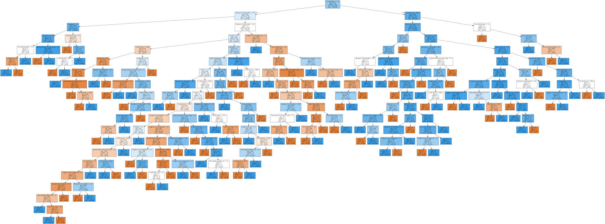
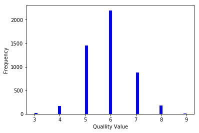

# Lab 1: Classification

### Author: Mahesh Mitikiri


```python
# Libraries

import pandas as pd
import numpy as np
import random
from sklearn.model_selection import train_test_split
from sklearn import tree
from sklearn.tree import DecisionTreeClassifier
from IPython.display import SVG
from graphviz import Source
from IPython.display import display
from sklearn.metrics import confusion_matrix
from sklearn.metrics import accuracy_score
from sklearn.ensemble import RandomForestClassifier
import matplotlib.pyplot as plt
from sklearn.tree import export_graphviz
import graphviz
from sklearn.metrics import mean_squared_error
import warnings
from math import sqrt
```

## Method 1: Tree-based classification


```python
input_file = r'C:\Users\mitikirim\Documents\Py\credit.csv'
credit = pd.read_csv(input_file)
credit.shape
```


    (1000, 21)


```python
#Explore data
credit.head(4)
```


<div>
<style scoped>
    .dataframe tbody tr th:only-of-type {
        vertical-align: middle;
    }

    .dataframe tbody tr th {
        vertical-align: top;
    }

    .dataframe thead th {
        text-align: right;
    }
</style>
<table border="1" class="dataframe">
  <thead>
    <tr style="text-align: right;">
      <th></th>
      <th>Creditability</th>
      <th>Account Balance</th>
      <th>Duration of Credit (month)</th>
      <th>Payment Status of Previous Credit</th>
      <th>Purpose</th>
      <th>Credit Amount</th>
      <th>Value Savings/Stocks</th>
      <th>Length of current employment</th>
      <th>Instalment per cent</th>
      <th>Sex &amp; Marital Status</th>
      <th>...</th>
      <th>Duration in Current address</th>
      <th>Most valuable available asset</th>
      <th>Age (years)</th>
      <th>Concurrent Credits</th>
      <th>Type of apartment</th>
      <th>No of Credits at this Bank</th>
      <th>Occupation</th>
      <th>No of dependents</th>
      <th>Telephone</th>
      <th>Foreign Worker</th>
    </tr>
  </thead>
  <tbody>
    <tr>
      <th>0</th>
      <td>1</td>
      <td>1</td>
      <td>18</td>
      <td>4</td>
      <td>2</td>
      <td>1049</td>
      <td>1</td>
      <td>2</td>
      <td>4</td>
      <td>2</td>
      <td>...</td>
      <td>4</td>
      <td>2</td>
      <td>21</td>
      <td>3</td>
      <td>1</td>
      <td>1</td>
      <td>3</td>
      <td>1</td>
      <td>1</td>
      <td>1</td>
    </tr>
    <tr>
      <th>1</th>
      <td>1</td>
      <td>1</td>
      <td>9</td>
      <td>4</td>
      <td>0</td>
      <td>2799</td>
      <td>1</td>
      <td>3</td>
      <td>2</td>
      <td>3</td>
      <td>...</td>
      <td>2</td>
      <td>1</td>
      <td>36</td>
      <td>3</td>
      <td>1</td>
      <td>2</td>
      <td>3</td>
      <td>2</td>
      <td>1</td>
      <td>1</td>
    </tr>
    <tr>
      <th>2</th>
      <td>1</td>
      <td>2</td>
      <td>12</td>
      <td>2</td>
      <td>9</td>
      <td>841</td>
      <td>2</td>
      <td>4</td>
      <td>2</td>
      <td>2</td>
      <td>...</td>
      <td>4</td>
      <td>1</td>
      <td>23</td>
      <td>3</td>
      <td>1</td>
      <td>1</td>
      <td>2</td>
      <td>1</td>
      <td>1</td>
      <td>1</td>
    </tr>
    <tr>
      <th>3</th>
      <td>1</td>
      <td>1</td>
      <td>12</td>
      <td>4</td>
      <td>0</td>
      <td>2122</td>
      <td>1</td>
      <td>3</td>
      <td>3</td>
      <td>3</td>
      <td>...</td>
      <td>2</td>
      <td>1</td>
      <td>39</td>
      <td>3</td>
      <td>1</td>
      <td>2</td>
      <td>2</td>
      <td>2</td>
      <td>1</td>
      <td>2</td>
    </tr>
  </tbody>
</table>
<p>4 rows × 21 columns</p>
</div>


```python
# Target variable
target = credit['Creditability']
target.value_counts()
```


    1    700
    0    300
    Name: Creditability, dtype: int64


```python
# Split: Method 1

random.seed(12345)
indx = random.sample(range(0, 1000), 1000)
credit_rand = credit.iloc[indx]
target_rand = target.iloc[indx]

credit_rand.head(5)
```


<div>
<style scoped>
    .dataframe tbody tr th:only-of-type {
        vertical-align: middle;
    }

    .dataframe tbody tr th {
        vertical-align: top;
    }

    .dataframe thead th {
        text-align: right;
    }
</style>
<table border="1" class="dataframe">
  <thead>
    <tr style="text-align: right;">
      <th></th>
      <th>Creditability</th>
      <th>Account Balance</th>
      <th>Duration of Credit (month)</th>
      <th>Payment Status of Previous Credit</th>
      <th>Purpose</th>
      <th>Credit Amount</th>
      <th>Value Savings/Stocks</th>
      <th>Length of current employment</th>
      <th>Instalment per cent</th>
      <th>Sex &amp; Marital Status</th>
      <th>...</th>
      <th>Duration in Current address</th>
      <th>Most valuable available asset</th>
      <th>Age (years)</th>
      <th>Concurrent Credits</th>
      <th>Type of apartment</th>
      <th>No of Credits at this Bank</th>
      <th>Occupation</th>
      <th>No of dependents</th>
      <th>Telephone</th>
      <th>Foreign Worker</th>
    </tr>
  </thead>
  <tbody>
    <tr>
      <th>426</th>
      <td>1</td>
      <td>2</td>
      <td>39</td>
      <td>3</td>
      <td>6</td>
      <td>11760</td>
      <td>2</td>
      <td>4</td>
      <td>2</td>
      <td>3</td>
      <td>...</td>
      <td>3</td>
      <td>4</td>
      <td>32</td>
      <td>3</td>
      <td>1</td>
      <td>1</td>
      <td>3</td>
      <td>1</td>
      <td>2</td>
      <td>1</td>
    </tr>
    <tr>
      <th>750</th>
      <td>1</td>
      <td>2</td>
      <td>36</td>
      <td>3</td>
      <td>0</td>
      <td>2862</td>
      <td>2</td>
      <td>5</td>
      <td>4</td>
      <td>3</td>
      <td>...</td>
      <td>3</td>
      <td>4</td>
      <td>30</td>
      <td>3</td>
      <td>3</td>
      <td>1</td>
      <td>3</td>
      <td>1</td>
      <td>1</td>
      <td>1</td>
    </tr>
    <tr>
      <th>10</th>
      <td>1</td>
      <td>1</td>
      <td>11</td>
      <td>4</td>
      <td>0</td>
      <td>3905</td>
      <td>1</td>
      <td>3</td>
      <td>2</td>
      <td>3</td>
      <td>...</td>
      <td>2</td>
      <td>1</td>
      <td>36</td>
      <td>3</td>
      <td>1</td>
      <td>2</td>
      <td>3</td>
      <td>2</td>
      <td>1</td>
      <td>1</td>
    </tr>
    <tr>
      <th>839</th>
      <td>0</td>
      <td>4</td>
      <td>12</td>
      <td>2</td>
      <td>0</td>
      <td>1386</td>
      <td>3</td>
      <td>3</td>
      <td>2</td>
      <td>2</td>
      <td>...</td>
      <td>2</td>
      <td>2</td>
      <td>26</td>
      <td>3</td>
      <td>2</td>
      <td>1</td>
      <td>3</td>
      <td>1</td>
      <td>1</td>
      <td>1</td>
    </tr>
    <tr>
      <th>845</th>
      <td>0</td>
      <td>2</td>
      <td>27</td>
      <td>4</td>
      <td>3</td>
      <td>2520</td>
      <td>3</td>
      <td>3</td>
      <td>4</td>
      <td>3</td>
      <td>...</td>
      <td>2</td>
      <td>2</td>
      <td>23</td>
      <td>3</td>
      <td>2</td>
      <td>2</td>
      <td>2</td>
      <td>1</td>
      <td>1</td>
      <td>1</td>
    </tr>
  </tbody>
</table>
<p>5 rows × 21 columns</p>
</div>


```python
credit_rand.describe()
```


<div>
<style scoped>
    .dataframe tbody tr th:only-of-type {
        vertical-align: middle;
    }

    .dataframe tbody tr th {
        vertical-align: top;
    }

    .dataframe thead th {
        text-align: right;
    }
</style>
<table border="1" class="dataframe">
  <thead>
    <tr style="text-align: right;">
      <th></th>
      <th>Creditability</th>
      <th>Account Balance</th>
      <th>Duration of Credit (month)</th>
      <th>Payment Status of Previous Credit</th>
      <th>Purpose</th>
      <th>Credit Amount</th>
      <th>Value Savings/Stocks</th>
      <th>Length of current employment</th>
      <th>Instalment per cent</th>
      <th>Sex &amp; Marital Status</th>
      <th>...</th>
      <th>Duration in Current address</th>
      <th>Most valuable available asset</th>
      <th>Age (years)</th>
      <th>Concurrent Credits</th>
      <th>Type of apartment</th>
      <th>No of Credits at this Bank</th>
      <th>Occupation</th>
      <th>No of dependents</th>
      <th>Telephone</th>
      <th>Foreign Worker</th>
    </tr>
  </thead>
  <tbody>
    <tr>
      <th>count</th>
      <td>1000.000000</td>
      <td>1000.000000</td>
      <td>1000.000000</td>
      <td>1000.00000</td>
      <td>1000.000000</td>
      <td>1000.00000</td>
      <td>1000.000000</td>
      <td>1000.000000</td>
      <td>1000.000000</td>
      <td>1000.00000</td>
      <td>...</td>
      <td>1000.000000</td>
      <td>1000.000000</td>
      <td>1000.00000</td>
      <td>1000.000000</td>
      <td>1000.000000</td>
      <td>1000.000000</td>
      <td>1000.000000</td>
      <td>1000.000000</td>
      <td>1000.000000</td>
      <td>1000.000000</td>
    </tr>
    <tr>
      <th>mean</th>
      <td>0.700000</td>
      <td>2.577000</td>
      <td>20.903000</td>
      <td>2.54500</td>
      <td>2.828000</td>
      <td>3271.24800</td>
      <td>2.105000</td>
      <td>3.384000</td>
      <td>2.973000</td>
      <td>2.68200</td>
      <td>...</td>
      <td>2.845000</td>
      <td>2.358000</td>
      <td>35.54200</td>
      <td>2.675000</td>
      <td>1.928000</td>
      <td>1.407000</td>
      <td>2.904000</td>
      <td>1.155000</td>
      <td>1.404000</td>
      <td>1.037000</td>
    </tr>
    <tr>
      <th>std</th>
      <td>0.458487</td>
      <td>1.257638</td>
      <td>12.058814</td>
      <td>1.08312</td>
      <td>2.744439</td>
      <td>2822.75176</td>
      <td>1.580023</td>
      <td>1.208306</td>
      <td>1.118715</td>
      <td>0.70808</td>
      <td>...</td>
      <td>1.103718</td>
      <td>1.050209</td>
      <td>11.35267</td>
      <td>0.705601</td>
      <td>0.530186</td>
      <td>0.577654</td>
      <td>0.653614</td>
      <td>0.362086</td>
      <td>0.490943</td>
      <td>0.188856</td>
    </tr>
    <tr>
      <th>min</th>
      <td>0.000000</td>
      <td>1.000000</td>
      <td>4.000000</td>
      <td>0.00000</td>
      <td>0.000000</td>
      <td>250.00000</td>
      <td>1.000000</td>
      <td>1.000000</td>
      <td>1.000000</td>
      <td>1.00000</td>
      <td>...</td>
      <td>1.000000</td>
      <td>1.000000</td>
      <td>19.00000</td>
      <td>1.000000</td>
      <td>1.000000</td>
      <td>1.000000</td>
      <td>1.000000</td>
      <td>1.000000</td>
      <td>1.000000</td>
      <td>1.000000</td>
    </tr>
    <tr>
      <th>25%</th>
      <td>0.000000</td>
      <td>1.000000</td>
      <td>12.000000</td>
      <td>2.00000</td>
      <td>1.000000</td>
      <td>1365.50000</td>
      <td>1.000000</td>
      <td>3.000000</td>
      <td>2.000000</td>
      <td>2.00000</td>
      <td>...</td>
      <td>2.000000</td>
      <td>1.000000</td>
      <td>27.00000</td>
      <td>3.000000</td>
      <td>2.000000</td>
      <td>1.000000</td>
      <td>3.000000</td>
      <td>1.000000</td>
      <td>1.000000</td>
      <td>1.000000</td>
    </tr>
    <tr>
      <th>50%</th>
      <td>1.000000</td>
      <td>2.000000</td>
      <td>18.000000</td>
      <td>2.00000</td>
      <td>2.000000</td>
      <td>2319.50000</td>
      <td>1.000000</td>
      <td>3.000000</td>
      <td>3.000000</td>
      <td>3.00000</td>
      <td>...</td>
      <td>3.000000</td>
      <td>2.000000</td>
      <td>33.00000</td>
      <td>3.000000</td>
      <td>2.000000</td>
      <td>1.000000</td>
      <td>3.000000</td>
      <td>1.000000</td>
      <td>1.000000</td>
      <td>1.000000</td>
    </tr>
    <tr>
      <th>75%</th>
      <td>1.000000</td>
      <td>4.000000</td>
      <td>24.000000</td>
      <td>4.00000</td>
      <td>3.000000</td>
      <td>3972.25000</td>
      <td>3.000000</td>
      <td>5.000000</td>
      <td>4.000000</td>
      <td>3.00000</td>
      <td>...</td>
      <td>4.000000</td>
      <td>3.000000</td>
      <td>42.00000</td>
      <td>3.000000</td>
      <td>2.000000</td>
      <td>2.000000</td>
      <td>3.000000</td>
      <td>1.000000</td>
      <td>2.000000</td>
      <td>1.000000</td>
    </tr>
    <tr>
      <th>max</th>
      <td>1.000000</td>
      <td>4.000000</td>
      <td>72.000000</td>
      <td>4.00000</td>
      <td>10.000000</td>
      <td>18424.00000</td>
      <td>5.000000</td>
      <td>5.000000</td>
      <td>4.000000</td>
      <td>4.00000</td>
      <td>...</td>
      <td>4.000000</td>
      <td>4.000000</td>
      <td>75.00000</td>
      <td>3.000000</td>
      <td>3.000000</td>
      <td>4.000000</td>
      <td>4.000000</td>
      <td>2.000000</td>
      <td>2.000000</td>
      <td>2.000000</td>
    </tr>
  </tbody>
</table>
<p>8 rows × 21 columns</p>
</div>


```python
credit_train = credit_rand.iloc[0:700]
credit_test = credit_rand.iloc[700:1000]
target_train = target_rand.iloc[0:700]
target_test = target_rand.iloc[700:1000]

target_train.value_counts()/700
```


    1    0.691429
    0    0.308571
    Name: Creditability, dtype: float64


```python
target_test.value_counts()/300
```


    1    0.72
    0    0.28
    Name: Creditability, dtype: float64


```python
# Split: Method 2
y = target
X = credit.drop(['Creditability'],axis=1)
X_train, X_test, y_train, y_test = train_test_split(X, y, test_size=0.30,
random_state=52)
```


```python
# Design decision tree

model = tree.DecisionTreeClassifier()
model = model.fit(X_train, y_train)
graph = Source(tree.export_graphviz(model, out_file=None
, feature_names=X.columns, class_names=['default', 'no default']
, filled = True))
display(SVG(graph.pipe(format='svg')))
y_predict = model.predict(X_test)
```





```python
print(confusion_matrix(y_test, y_predict))
```

    [[ 41  43]
     [ 53 163]]
    


```python
print(accuracy_score(y_test, y_predict)*100)
```

    68.0
    

## Q1: Accuracy of 100%

**Ans** We do not see a accuracy of 100% here. The accuracy we see here is about 68%. This means our model correctly predicts outcome variable 68% of the times. An accuracy of 100% does not always mean we have a perfect model. The same model could produce less accuracy on different dataset. If we have a accuracy of 100%, that means our classification problem is a easy one. In real world, this is seldom true. By changing test set and train set proportions, we may get different results. Also, the model may not perform as accurately on unseen data. This can be verified by out of sample AUC. In addition, the sample may not be always randomly distributed.

## Random forest


```python
clf = RandomForestClassifier()
clf.fit(X_train, y_train)
y_predict = clf.predict(X_test)
print(confusion_matrix(y_test, y_predict))
warnings.filterwarnings('ignore')
```

    [[ 45  39]
     [ 41 175]]
    


```python
print(accuracy_score(y_test, y_predict)*100)
```

    73.33333333333333
    

## Q2: Important Features:


```python
feature_importances = pd.DataFrame(clf.feature_importances_,
columns=['importance']).sort_values('importance', ascending=False)
feature_importances
```


<div>
<style scoped>
    .dataframe tbody tr th:only-of-type {
        vertical-align: middle;
    }

    .dataframe tbody tr th {
        vertical-align: top;
    }

    .dataframe thead th {
        text-align: right;
    }
</style>
<table border="1" class="dataframe">
  <thead>
    <tr style="text-align: right;">
      <th></th>
      <th>importance</th>
    </tr>
  </thead>
  <tbody>
    <tr>
      <th>4</th>
      <td>0.130444</td>
    </tr>
    <tr>
      <th>1</th>
      <td>0.121403</td>
    </tr>
    <tr>
      <th>12</th>
      <td>0.107504</td>
    </tr>
    <tr>
      <th>0</th>
      <td>0.100461</td>
    </tr>
    <tr>
      <th>3</th>
      <td>0.061530</td>
    </tr>
    <tr>
      <th>2</th>
      <td>0.061096</td>
    </tr>
    <tr>
      <th>6</th>
      <td>0.049807</td>
    </tr>
    <tr>
      <th>5</th>
      <td>0.046666</td>
    </tr>
    <tr>
      <th>7</th>
      <td>0.045601</td>
    </tr>
    <tr>
      <th>10</th>
      <td>0.040287</td>
    </tr>
    <tr>
      <th>8</th>
      <td>0.039448</td>
    </tr>
    <tr>
      <th>11</th>
      <td>0.034165</td>
    </tr>
    <tr>
      <th>14</th>
      <td>0.032394</td>
    </tr>
    <tr>
      <th>16</th>
      <td>0.028580</td>
    </tr>
    <tr>
      <th>15</th>
      <td>0.025091</td>
    </tr>
    <tr>
      <th>13</th>
      <td>0.024005</td>
    </tr>
    <tr>
      <th>9</th>
      <td>0.018230</td>
    </tr>
    <tr>
      <th>18</th>
      <td>0.018153</td>
    </tr>
    <tr>
      <th>17</th>
      <td>0.010126</td>
    </tr>
    <tr>
      <th>19</th>
      <td>0.005006</td>
    </tr>
  </tbody>
</table>
</div>


Three most important features of the model are: Credit Amount, Duration of credit (month) and Age(years). This is true since more the Duration of the credit, more is the amount of data available, more the credit, more is the usage.


```python
X_train.columns.values
```


    array(['Account Balance', 'Duration of Credit (month)',
           'Payment Status of Previous Credit', 'Purpose', 'Credit Amount',
           'Value Savings/Stocks', 'Length of current employment',
           'Instalment per cent', 'Sex & Marital Status', 'Guarantors',
           'Duration in Current address', 'Most valuable available asset',
           'Age (years)', 'Concurrent Credits', 'Type of apartment',
           'No of Credits at this Bank', 'Occupation', 'No of dependents',
           'Telephone', 'Foreign Worker'], dtype=object)


### New random seed of 23458


```python
X_train, X_test, y_train, y_test = train_test_split(X, y, test_size=0.30,
random_state=23458)
clf = RandomForestClassifier()
clf.fit(X_train, y_train)
y_predict = clf.predict(X_test)
print(confusion_matrix(y_test, y_predict))
warnings.filterwarnings('ignore')
```

    [[ 43  39]
     [ 35 183]]
    


```python
print(accuracy_score(y_test, y_predict)*100)
```

    75.33333333333333
    

## Method 3: Addign regression to trees


```python
input_file = r"C:\Users\mitikirim\Documents\Py\whitewines.csv"
wine = pd.read_csv(input_file)
wine.head(5)
```


<div>
<style scoped>
    .dataframe tbody tr th:only-of-type {
        vertical-align: middle;
    }

    .dataframe tbody tr th {
        vertical-align: top;
    }

    .dataframe thead th {
        text-align: right;
    }
</style>
<table border="1" class="dataframe">
  <thead>
    <tr style="text-align: right;">
      <th></th>
      <th>fixed acidity</th>
      <th>volatile acidity</th>
      <th>citric acid</th>
      <th>residual sugar</th>
      <th>chlorides</th>
      <th>free sulfur dioxide</th>
      <th>total sulfur dioxide</th>
      <th>density</th>
      <th>pH</th>
      <th>sulphates</th>
      <th>alcohol</th>
      <th>quality</th>
    </tr>
  </thead>
  <tbody>
    <tr>
      <th>0</th>
      <td>6.7</td>
      <td>0.62</td>
      <td>0.24</td>
      <td>1.10</td>
      <td>0.039</td>
      <td>6.0</td>
      <td>62.0</td>
      <td>0.99340</td>
      <td>3.41</td>
      <td>0.32</td>
      <td>10.400000</td>
      <td>5</td>
    </tr>
    <tr>
      <th>1</th>
      <td>5.7</td>
      <td>0.22</td>
      <td>0.20</td>
      <td>16.00</td>
      <td>0.044</td>
      <td>41.0</td>
      <td>113.0</td>
      <td>0.99862</td>
      <td>3.22</td>
      <td>0.46</td>
      <td>8.900000</td>
      <td>6</td>
    </tr>
    <tr>
      <th>2</th>
      <td>5.9</td>
      <td>0.19</td>
      <td>0.26</td>
      <td>7.40</td>
      <td>0.034</td>
      <td>33.0</td>
      <td>123.0</td>
      <td>0.99500</td>
      <td>3.49</td>
      <td>0.42</td>
      <td>10.100000</td>
      <td>6</td>
    </tr>
    <tr>
      <th>3</th>
      <td>5.3</td>
      <td>0.47</td>
      <td>0.10</td>
      <td>1.30</td>
      <td>0.036</td>
      <td>11.0</td>
      <td>74.0</td>
      <td>0.99082</td>
      <td>3.48</td>
      <td>0.54</td>
      <td>11.200000</td>
      <td>4</td>
    </tr>
    <tr>
      <th>4</th>
      <td>6.4</td>
      <td>0.29</td>
      <td>0.21</td>
      <td>9.65</td>
      <td>0.041</td>
      <td>36.0</td>
      <td>119.0</td>
      <td>0.99334</td>
      <td>2.99</td>
      <td>0.34</td>
      <td>10.933333</td>
      <td>6</td>
    </tr>
  </tbody>
</table>
</div>


```python
n, bins, patches = plt.hist(x=wine['quality'], bins='auto', color='b', )
plt.xlabel('Quallity Value')
plt.ylabel('Frequency')
plt.show()
```





```python
# Split the data

target = wine['quality']
target.value_counts()
```


    6    2198
    5    1457
    7     880
    8     175
    4     163
    3      20
    9       5
    Name: quality, dtype: int64


```python
y = target
X = wine.drop(['quality'],axis=1)
X_train, X_test, y_train, y_test = train_test_split(X, y, test_size=0.25,
random_state=52)

model = tree.DecisionTreeClassifier()
model = model.fit(X_train, y_train)

export_graphviz(model, out_file =r'C:\Users\mitikirim\Documents\Py\tree.dot', feature_names =X.columns)

dot_data = tree.export_graphviz(model, out_file=None,
                                feature_names=X.columns,
                                filled=True, rounded=True,
                                special_characters=True)
graph = graphviz.Source(dot_data)
graph
```


```python
y_predict = model.predict(X_test)
print(confusion_matrix(y_test, y_predict))
```

    [[  0   2   1   0   1   1   0]
     [  0   9  12   9   1   0   0]
     [  3  11 221 102  13   2   0]
     [  3  12  98 384  50  14   0]
     [  0   1  13  63 136  11   0]
     [  0   0   2  16  14  19   0]
     [  0   0   0   0   1   0   0]]
    


```python
print(accuracy_score(y_test, y_predict)*100)
```

    62.77551020408163
    


```python
np.corrcoef(y_test,y_predict)
```


    array([[1.       , 0.5683274],
           [0.5683274, 1.       ]])


```python
sqrt(mean_squared_error(y_test,y_predict))
```


    0.8146615673933287


## Q3: RMSE

Root Mean Squared Error is a measure to evaluate error rate of a model. Often times, our output does not perfectly fit the input. This deviation of output from input points is called error and one way of measuring it is by RMSE given the units of both inut and output are the same. Also, it is inversely proportional to correlation coefficient of the model. If the correlation coefficient is 1 then the RMSE is 0. Here we have a correlation coefficient of about 56%. And the RMSE is about 81%. This implies, the current model for the given dataset is a good one.

## Method 3: News Popularity


```python
input_news = r"C:\Users\mitikirim\Documents\Py\OnlineNewsPopularity_for_python.csv"
news = pd.read_csv(input_news)
news.head(6)
```


<div>
<style scoped>
    .dataframe tbody tr th:only-of-type {
        vertical-align: middle;
    }

    .dataframe tbody tr th {
        vertical-align: top;
    }

    .dataframe thead th {
        text-align: right;
    }
</style>
<table border="1" class="dataframe">
  <thead>
    <tr style="text-align: right;">
      <th></th>
      <th>url</th>
      <th>timedelta</th>
      <th>n_tokens_title</th>
      <th>n_tokens_content</th>
      <th>n_unique_tokens</th>
      <th>n_non_stop_words</th>
      <th>n_non_stop_unique_tokens</th>
      <th>num_hrefs</th>
      <th>num_self_hrefs</th>
      <th>num_imgs</th>
      <th>...</th>
      <th>min_positive_polarity</th>
      <th>max_positive_polarity</th>
      <th>avg_negative_polarity</th>
      <th>min_negative_polarity</th>
      <th>max_negative_polarity</th>
      <th>title_subjectivity</th>
      <th>title_sentiment_polarity</th>
      <th>abs_title_subjectivity</th>
      <th>abs_title_sentiment_polarity</th>
      <th>shares</th>
    </tr>
  </thead>
  <tbody>
    <tr>
      <th>0</th>
      <td>http://mashable.com/2013/01/07/amazon-instant-...</td>
      <td>731</td>
      <td>12</td>
      <td>219</td>
      <td>0.663594</td>
      <td>1.0</td>
      <td>0.815385</td>
      <td>4</td>
      <td>2</td>
      <td>1</td>
      <td>...</td>
      <td>0.100000</td>
      <td>0.7</td>
      <td>-0.350000</td>
      <td>-0.600</td>
      <td>-0.200000</td>
      <td>0.500000</td>
      <td>-0.187500</td>
      <td>0.000000</td>
      <td>0.187500</td>
      <td>593</td>
    </tr>
    <tr>
      <th>1</th>
      <td>http://mashable.com/2013/01/07/ap-samsung-spon...</td>
      <td>731</td>
      <td>9</td>
      <td>255</td>
      <td>0.604743</td>
      <td>1.0</td>
      <td>0.791946</td>
      <td>3</td>
      <td>1</td>
      <td>1</td>
      <td>...</td>
      <td>0.033333</td>
      <td>0.7</td>
      <td>-0.118750</td>
      <td>-0.125</td>
      <td>-0.100000</td>
      <td>0.000000</td>
      <td>0.000000</td>
      <td>0.500000</td>
      <td>0.000000</td>
      <td>711</td>
    </tr>
    <tr>
      <th>2</th>
      <td>http://mashable.com/2013/01/07/apple-40-billio...</td>
      <td>731</td>
      <td>9</td>
      <td>211</td>
      <td>0.575130</td>
      <td>1.0</td>
      <td>0.663866</td>
      <td>3</td>
      <td>1</td>
      <td>1</td>
      <td>...</td>
      <td>0.100000</td>
      <td>1.0</td>
      <td>-0.466667</td>
      <td>-0.800</td>
      <td>-0.133333</td>
      <td>0.000000</td>
      <td>0.000000</td>
      <td>0.500000</td>
      <td>0.000000</td>
      <td>1500</td>
    </tr>
    <tr>
      <th>3</th>
      <td>http://mashable.com/2013/01/07/astronaut-notre...</td>
      <td>731</td>
      <td>9</td>
      <td>531</td>
      <td>0.503788</td>
      <td>1.0</td>
      <td>0.665635</td>
      <td>9</td>
      <td>0</td>
      <td>1</td>
      <td>...</td>
      <td>0.136364</td>
      <td>0.8</td>
      <td>-0.369697</td>
      <td>-0.600</td>
      <td>-0.166667</td>
      <td>0.000000</td>
      <td>0.000000</td>
      <td>0.500000</td>
      <td>0.000000</td>
      <td>1200</td>
    </tr>
    <tr>
      <th>4</th>
      <td>http://mashable.com/2013/01/07/att-u-verse-apps/</td>
      <td>731</td>
      <td>13</td>
      <td>1072</td>
      <td>0.415646</td>
      <td>1.0</td>
      <td>0.540890</td>
      <td>19</td>
      <td>19</td>
      <td>20</td>
      <td>...</td>
      <td>0.033333</td>
      <td>1.0</td>
      <td>-0.220192</td>
      <td>-0.500</td>
      <td>-0.050000</td>
      <td>0.454545</td>
      <td>0.136364</td>
      <td>0.045455</td>
      <td>0.136364</td>
      <td>505</td>
    </tr>
    <tr>
      <th>5</th>
      <td>http://mashable.com/2013/01/07/beewi-smart-toys/</td>
      <td>731</td>
      <td>10</td>
      <td>370</td>
      <td>0.559889</td>
      <td>1.0</td>
      <td>0.698198</td>
      <td>2</td>
      <td>2</td>
      <td>0</td>
      <td>...</td>
      <td>0.136364</td>
      <td>0.6</td>
      <td>-0.195000</td>
      <td>-0.400</td>
      <td>-0.100000</td>
      <td>0.642857</td>
      <td>0.214286</td>
      <td>0.142857</td>
      <td>0.214286</td>
      <td>855</td>
    </tr>
  </tbody>
</table>
<p>6 rows × 61 columns</p>
</div>


```python
# Pre-processing

popular = news.shares >= 1400
unpopular = news.shares < 1400
news.loc[popular,'shares'] = 1
news.loc[unpopular,'shares'] = 0

target = news['shares']
target.value_counts()

y = target
X = news.drop(['url','shares'],axis=1)
X_train, X_test, y_train, y_test = train_test_split(X, y, test_size=0.30,
random_state=9)

y.value_counts()
```


    1    21154
    0    18490
    Name: shares, dtype: int64


## Q4: Try decision tree and random forest and evaluate the model.


```python

model = tree.DecisionTreeClassifier()
model = model.fit(X_train, y_train)

graph = Source(tree.export_graphviz(model, out_file=None
, feature_names=X.columns, class_names=['default', 'no default']
, filled = True))
display(SVG(graph.pipe(format='svg')))

```


```python
y_predict = model.predict(X_test)
print(confusion_matrix(y_test, y_predict))
```

    [[3063 2405]
     [2551 3875]]
    


```python
print(accuracy_score(y_test, y_predict)*100)
```

    58.3319320665882
    


```python
# Random forest

clf = RandomForestClassifier()
clf.fit(X_train, y_train)
y_predict = clf.predict(X_test)
print(confusion_matrix(y_test, y_predict))
warnings.filterwarnings('ignore')
```

    [[3591 1877]
     [2574 3852]]
    


```python
print(accuracy_score(y_test, y_predict)*100)
```

    62.57777030435514
    

Random forest yields higher accuracy compared to Decision trees 58.33 vs 62.577. Although False Negatives are similar for both the confusion matrices, Random forest model has significantly better False Positives there by increasing accuracy of the classification. Random forest is one of the best models in terms of classication. It achieves higher classification accuracy by eliminating overfitting by averaging multiple decision trees.
