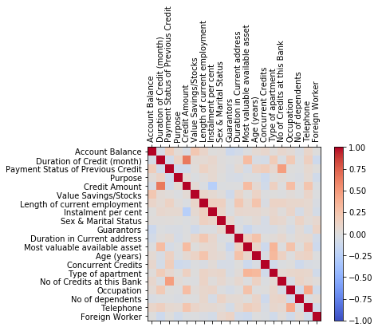
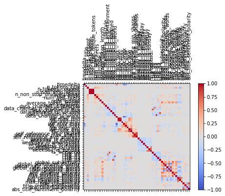

# L2: Prescriptive Analytics
### Author: Mahesh Mitikiri


```python
# Libraries

import pandas as pd
import numpy as np
import random
from sklearn.model_selection import train_test_split
from sklearn import tree
from sklearn.tree import DecisionTreeClassifier
from sklearn.metrics import confusion_matrix
from sklearn.metrics import accuracy_score
from sklearn.ensemble import RandomForestClassifier
import matplotlib.pyplot as plt
from sklearn.metrics import mean_squared_error
import warnings
from math import sqrt
from sklearn.naive_bayes import GaussianNB
from sklearn import svm
from sklearn.svm import LinearSVC
```

## Part1: Naïve Bayes Classifiers

#### Step1: Exploring and Preparing the Data


```python
input_file = r'C:\Users\mitikirim\Documents\Py\creditData.csv'
credit = pd.read_csv(input_file)
credit.shape
```


    (1000, 21)


```python
credit.head(5)
```


<div>
<style scoped>
    .dataframe tbody tr th:only-of-type {
        vertical-align: middle;
    }

    .dataframe tbody tr th {
        vertical-align: top;
    }

    .dataframe thead th {
        text-align: right;
    }
</style>
<table border="1" class="dataframe">
  <thead>
    <tr style="text-align: right;">
      <th></th>
      <th>Creditability</th>
      <th>Account Balance</th>
      <th>Duration of Credit (month)</th>
      <th>Payment Status of Previous Credit</th>
      <th>Purpose</th>
      <th>Credit Amount</th>
      <th>Value Savings/Stocks</th>
      <th>Length of current employment</th>
      <th>Instalment per cent</th>
      <th>Sex &amp; Marital Status</th>
      <th>...</th>
      <th>Duration in Current address</th>
      <th>Most valuable available asset</th>
      <th>Age (years)</th>
      <th>Concurrent Credits</th>
      <th>Type of apartment</th>
      <th>No of Credits at this Bank</th>
      <th>Occupation</th>
      <th>No of dependents</th>
      <th>Telephone</th>
      <th>Foreign Worker</th>
    </tr>
  </thead>
  <tbody>
    <tr>
      <th>0</th>
      <td>1</td>
      <td>1</td>
      <td>18</td>
      <td>4</td>
      <td>2</td>
      <td>1049</td>
      <td>1</td>
      <td>2</td>
      <td>4</td>
      <td>2</td>
      <td>...</td>
      <td>4</td>
      <td>2</td>
      <td>21</td>
      <td>3</td>
      <td>1</td>
      <td>1</td>
      <td>3</td>
      <td>1</td>
      <td>1</td>
      <td>1</td>
    </tr>
    <tr>
      <th>1</th>
      <td>1</td>
      <td>1</td>
      <td>9</td>
      <td>4</td>
      <td>0</td>
      <td>2799</td>
      <td>1</td>
      <td>3</td>
      <td>2</td>
      <td>3</td>
      <td>...</td>
      <td>2</td>
      <td>1</td>
      <td>36</td>
      <td>3</td>
      <td>1</td>
      <td>2</td>
      <td>3</td>
      <td>2</td>
      <td>1</td>
      <td>1</td>
    </tr>
    <tr>
      <th>2</th>
      <td>1</td>
      <td>2</td>
      <td>12</td>
      <td>2</td>
      <td>9</td>
      <td>841</td>
      <td>2</td>
      <td>4</td>
      <td>2</td>
      <td>2</td>
      <td>...</td>
      <td>4</td>
      <td>1</td>
      <td>23</td>
      <td>3</td>
      <td>1</td>
      <td>1</td>
      <td>2</td>
      <td>1</td>
      <td>1</td>
      <td>1</td>
    </tr>
    <tr>
      <th>3</th>
      <td>1</td>
      <td>1</td>
      <td>12</td>
      <td>4</td>
      <td>0</td>
      <td>2122</td>
      <td>1</td>
      <td>3</td>
      <td>3</td>
      <td>3</td>
      <td>...</td>
      <td>2</td>
      <td>1</td>
      <td>39</td>
      <td>3</td>
      <td>1</td>
      <td>2</td>
      <td>2</td>
      <td>2</td>
      <td>1</td>
      <td>2</td>
    </tr>
    <tr>
      <th>4</th>
      <td>1</td>
      <td>1</td>
      <td>12</td>
      <td>4</td>
      <td>0</td>
      <td>2171</td>
      <td>1</td>
      <td>3</td>
      <td>4</td>
      <td>3</td>
      <td>...</td>
      <td>4</td>
      <td>2</td>
      <td>38</td>
      <td>1</td>
      <td>2</td>
      <td>2</td>
      <td>2</td>
      <td>1</td>
      <td>1</td>
      <td>2</td>
    </tr>
  </tbody>
</table>
<p>5 rows × 21 columns</p>
</div>


```python
credit.isnull().sum()
```


    Creditability                        0
    Account Balance                      0
    Duration of Credit (month)           0
    Payment Status of Previous Credit    0
    Purpose                              0
    Credit Amount                        0
    Value Savings/Stocks                 0
    Length of current employment         0
    Instalment per cent                  0
    Sex & Marital Status                 0
    Guarantors                           0
    Duration in Current address          0
    Most valuable available asset        0
    Age (years)                          0
    Concurrent Credits                   0
    Type of apartment                    0
    No of Credits at this Bank           0
    Occupation                           0
    No of dependents                     0
    Telephone                            0
    Foreign Worker                       0
    dtype: int64


```python
credit.isnull().sum().sum()
```


    0


### Q1: What is your suggestion if you see any NA values?

#### Ans: There are no missing values in the current dataset. However, there are several ways to deal with missing values and it depends on the dataset, the number of missing values, the problem we are trying to model. Solutions range from deleting the rows or columns to interpolating the data to using algorithms to find a pattern using rows that have non-missing values and assign it to the missing value. If the number of missing values are very low, it is generally OK to delete the entire row. If a non-significant column has missing values, it is safe to delete the entire column. There would be minor tradeoffs by doing this. We can also build classification models that learns patterns from the dataset and assigns a value to the missing value. We can also use mean or median values to replace the missing values. In the end, it comes down to the dataset and the probelm we are trying to solve.


```python
target = credit['Creditability']
target.value_counts()
```


    1    700
    0    300
    Name: Creditability, dtype: int64


```python
y = target
X = credit.drop(['Creditability'],axis=1)
X_train, X_test, y_train, y_test = train_test_split(X, y, test_size=0.25,
random_state=123)
```

### Q2: Compute the percentage of both classes and see if the distribution of both classes preserved for both training and testing data.

#### Ans: The algorithm did its best to preserve the class distributions. For training data, it is almost 70-30 just like original data. However, for testing data, it is off by a bit: 66:34. We may improve this choosing a different random seed.


```python
y_train.value_counts()/750
```


    1    0.713333
    0    0.286667
    Name: Creditability, dtype: float64


```python
y_test.value_counts()/250
```


    1    0.66
    0    0.34
    Name: Creditability, dtype: float64


```python
y_train.isnull().sum().sum()
```


    0


```python
y_test.isnull().sum().sum()
```


    0


#### Step2: Training a Model on the Data


```python
gnb = GaussianNB()
gnb = gnb.fit(X_train, y_train)
```

#### Step3: Evaluating Model Performance


```python
y_predict = gnb.fit(X_train, y_train).predict(X_test)
print(confusion_matrix(y_test, y_predict))
```

    [[ 60  25]
     [ 34 131]]
    


```python
print(accuracy_score(y_test, y_predict)*100)
```

    76.4
    

## Part2: Naïve Bayes Classifiers

#### Step1: Exploring and Preparing the Data

#### Finding Correlation


```python
corr = X_train.corr()
fig = plt.figure()
ax = fig.add_subplot(111)
cax = ax.matshow(corr,cmap='coolwarm', vmin=-1, vmax=1)
fig.colorbar(cax)
ticks = np.arange(0,len(X_train.columns),1)
ax.set_xticks(ticks)
plt.xticks(rotation=90)
ax.set_yticks(ticks)
ax.set_xticklabels(X_train.columns)
ax.set_yticklabels(X_train.columns)
plt.show()
```





```python
corr
```


<div>
<style scoped>
    .dataframe tbody tr th:only-of-type {
        vertical-align: middle;
    }

    .dataframe tbody tr th {
        vertical-align: top;
    }

    .dataframe thead th {
        text-align: right;
    }
</style>
<table border="1" class="dataframe">
  <thead>
    <tr style="text-align: right;">
      <th></th>
      <th>Account Balance</th>
      <th>Duration of Credit (month)</th>
      <th>Payment Status of Previous Credit</th>
      <th>Purpose</th>
      <th>Credit Amount</th>
      <th>Value Savings/Stocks</th>
      <th>Length of current employment</th>
      <th>Instalment per cent</th>
      <th>Sex &amp; Marital Status</th>
      <th>Guarantors</th>
      <th>Duration in Current address</th>
      <th>Most valuable available asset</th>
      <th>Age (years)</th>
      <th>Concurrent Credits</th>
      <th>Type of apartment</th>
      <th>No of Credits at this Bank</th>
      <th>Occupation</th>
      <th>No of dependents</th>
      <th>Telephone</th>
      <th>Foreign Worker</th>
    </tr>
  </thead>
  <tbody>
    <tr>
      <th>Account Balance</th>
      <td>1.000000</td>
      <td>-0.062104</td>
      <td>0.172259</td>
      <td>0.036222</td>
      <td>-0.041421</td>
      <td>0.220177</td>
      <td>0.102695</td>
      <td>0.002743</td>
      <td>0.017441</td>
      <td>-0.122594</td>
      <td>-0.070574</td>
      <td>-0.015112</td>
      <td>0.048992</td>
      <td>0.080565</td>
      <td>0.019469</td>
      <td>0.079008</td>
      <td>0.045209</td>
      <td>-0.036185</td>
      <td>0.095746</td>
      <td>0.003261</td>
    </tr>
    <tr>
      <th>Duration of Credit (month)</th>
      <td>-0.062104</td>
      <td>1.000000</td>
      <td>-0.093288</td>
      <td>0.112558</td>
      <td>0.642393</td>
      <td>0.044363</td>
      <td>0.050067</td>
      <td>0.078660</td>
      <td>0.011237</td>
      <td>-0.014766</td>
      <td>0.009824</td>
      <td>0.300370</td>
      <td>-0.040874</td>
      <td>-0.064931</td>
      <td>0.183366</td>
      <td>-0.031074</td>
      <td>0.202715</td>
      <td>-0.021684</td>
      <td>0.150004</td>
      <td>-0.117130</td>
    </tr>
    <tr>
      <th>Payment Status of Previous Credit</th>
      <td>0.172259</td>
      <td>-0.093288</td>
      <td>1.000000</td>
      <td>-0.095751</td>
      <td>-0.089465</td>
      <td>0.022727</td>
      <td>0.126453</td>
      <td>0.065816</td>
      <td>0.023332</td>
      <td>-0.032025</td>
      <td>0.050054</td>
      <td>-0.057508</td>
      <td>0.135076</td>
      <td>0.174614</td>
      <td>0.076961</td>
      <td>0.472235</td>
      <td>0.001892</td>
      <td>-0.015349</td>
      <td>0.065570</td>
      <td>0.004851</td>
    </tr>
    <tr>
      <th>Purpose</th>
      <td>0.036222</td>
      <td>0.112558</td>
      <td>-0.095751</td>
      <td>1.000000</td>
      <td>0.050689</td>
      <td>-0.022071</td>
      <td>0.017176</td>
      <td>0.068256</td>
      <td>0.002013</td>
      <td>-0.039182</td>
      <td>-0.062045</td>
      <td>-0.012689</td>
      <td>-0.017316</td>
      <td>-0.110319</td>
      <td>0.003241</td>
      <td>0.033563</td>
      <td>-0.008944</td>
      <td>-0.036686</td>
      <td>0.053793</td>
      <td>-0.093726</td>
    </tr>
    <tr>
      <th>Credit Amount</th>
      <td>-0.041421</td>
      <td>0.642393</td>
      <td>-0.089465</td>
      <td>0.050689</td>
      <td>1.000000</td>
      <td>0.040768</td>
      <td>-0.023630</td>
      <td>-0.250021</td>
      <td>-0.020633</td>
      <td>-0.011250</td>
      <td>-0.003273</td>
      <td>0.299685</td>
      <td>0.054775</td>
      <td>-0.090039</td>
      <td>0.144418</td>
      <td>-0.004102</td>
      <td>0.292673</td>
      <td>-0.007566</td>
      <td>0.241670</td>
      <td>-0.027294</td>
    </tr>
    <tr>
      <th>Value Savings/Stocks</th>
      <td>0.220177</td>
      <td>0.044363</td>
      <td>0.022727</td>
      <td>-0.022071</td>
      <td>0.040768</td>
      <td>1.000000</td>
      <td>0.100794</td>
      <td>0.058960</td>
      <td>0.010455</td>
      <td>-0.096418</td>
      <td>0.095004</td>
      <td>0.005992</td>
      <td>0.120832</td>
      <td>-0.008873</td>
      <td>0.005913</td>
      <td>-0.014172</td>
      <td>0.024694</td>
      <td>-0.000311</td>
      <td>0.105903</td>
      <td>-0.009764</td>
    </tr>
    <tr>
      <th>Length of current employment</th>
      <td>0.102695</td>
      <td>0.050067</td>
      <td>0.126453</td>
      <td>0.017176</td>
      <td>-0.023630</td>
      <td>0.100794</td>
      <td>1.000000</td>
      <td>0.155636</td>
      <td>0.145088</td>
      <td>-0.028015</td>
      <td>0.226195</td>
      <td>0.062685</td>
      <td>0.242902</td>
      <td>-0.031907</td>
      <td>0.123352</td>
      <td>0.122989</td>
      <td>0.091084</td>
      <td>0.093320</td>
      <td>0.069270</td>
      <td>-0.035442</td>
    </tr>
    <tr>
      <th>Instalment per cent</th>
      <td>0.002743</td>
      <td>0.078660</td>
      <td>0.065816</td>
      <td>0.068256</td>
      <td>-0.250021</td>
      <td>0.058960</td>
      <td>0.155636</td>
      <td>1.000000</td>
      <td>0.102433</td>
      <td>-0.020120</td>
      <td>0.081159</td>
      <td>0.071845</td>
      <td>0.075679</td>
      <td>0.034560</td>
      <td>0.080369</td>
      <td>0.009830</td>
      <td>0.107890</td>
      <td>-0.061008</td>
      <td>0.058794</td>
      <td>-0.068601</td>
    </tr>
    <tr>
      <th>Sex &amp; Marital Status</th>
      <td>0.017441</td>
      <td>0.011237</td>
      <td>0.023332</td>
      <td>0.002013</td>
      <td>-0.020633</td>
      <td>0.010455</td>
      <td>0.145088</td>
      <td>0.102433</td>
      <td>1.000000</td>
      <td>0.077056</td>
      <td>-0.026712</td>
      <td>0.002089</td>
      <td>0.042476</td>
      <td>-0.059043</td>
      <td>0.100918</td>
      <td>0.073067</td>
      <td>-0.015566</td>
      <td>0.124822</td>
      <td>0.034628</td>
      <td>0.071191</td>
    </tr>
    <tr>
      <th>Guarantors</th>
      <td>-0.122594</td>
      <td>-0.014766</td>
      <td>-0.032025</td>
      <td>-0.039182</td>
      <td>-0.011250</td>
      <td>-0.096418</td>
      <td>-0.028015</td>
      <td>-0.020120</td>
      <td>0.077056</td>
      <td>1.000000</td>
      <td>-0.014693</td>
      <td>-0.138584</td>
      <td>-0.053715</td>
      <td>-0.051112</td>
      <td>-0.042368</td>
      <td>0.008676</td>
      <td>-0.055301</td>
      <td>0.042532</td>
      <td>-0.070055</td>
      <td>0.122889</td>
    </tr>
    <tr>
      <th>Duration in Current address</th>
      <td>-0.070574</td>
      <td>0.009824</td>
      <td>0.050054</td>
      <td>-0.062045</td>
      <td>-0.003273</td>
      <td>0.095004</td>
      <td>0.226195</td>
      <td>0.081159</td>
      <td>-0.026712</td>
      <td>-0.014693</td>
      <td>1.000000</td>
      <td>0.137052</td>
      <td>0.258118</td>
      <td>0.007406</td>
      <td>0.029429</td>
      <td>0.074730</td>
      <td>-0.004036</td>
      <td>0.051605</td>
      <td>0.068808</td>
      <td>-0.079840</td>
    </tr>
    <tr>
      <th>Most valuable available asset</th>
      <td>-0.015112</td>
      <td>0.300370</td>
      <td>-0.057508</td>
      <td>-0.012689</td>
      <td>0.299685</td>
      <td>0.005992</td>
      <td>0.062685</td>
      <td>0.071845</td>
      <td>0.002089</td>
      <td>-0.138584</td>
      <td>0.137052</td>
      <td>1.000000</td>
      <td>0.095816</td>
      <td>-0.110943</td>
      <td>0.348408</td>
      <td>-0.011340</td>
      <td>0.264541</td>
      <td>0.005662</td>
      <td>0.177985</td>
      <td>-0.110820</td>
    </tr>
    <tr>
      <th>Age (years)</th>
      <td>0.048992</td>
      <td>-0.040874</td>
      <td>0.135076</td>
      <td>-0.017316</td>
      <td>0.054775</td>
      <td>0.120832</td>
      <td>0.242902</td>
      <td>0.075679</td>
      <td>0.042476</td>
      <td>-0.053715</td>
      <td>0.258118</td>
      <td>0.095816</td>
      <td>1.000000</td>
      <td>-0.038303</td>
      <td>0.325199</td>
      <td>0.134174</td>
      <td>-0.001881</td>
      <td>0.103177</td>
      <td>0.130897</td>
      <td>-0.000298</td>
    </tr>
    <tr>
      <th>Concurrent Credits</th>
      <td>0.080565</td>
      <td>-0.064931</td>
      <td>0.174614</td>
      <td>-0.110319</td>
      <td>-0.090039</td>
      <td>-0.008873</td>
      <td>-0.031907</td>
      <td>0.034560</td>
      <td>-0.059043</td>
      <td>-0.051112</td>
      <td>0.007406</td>
      <td>-0.110943</td>
      <td>-0.038303</td>
      <td>1.000000</td>
      <td>-0.093470</td>
      <td>-0.022408</td>
      <td>0.000913</td>
      <td>-0.103610</td>
      <td>-0.041874</td>
      <td>-0.030669</td>
    </tr>
    <tr>
      <th>Type of apartment</th>
      <td>0.019469</td>
      <td>0.183366</td>
      <td>0.076961</td>
      <td>0.003241</td>
      <td>0.144418</td>
      <td>0.005913</td>
      <td>0.123352</td>
      <td>0.080369</td>
      <td>0.100918</td>
      <td>-0.042368</td>
      <td>0.029429</td>
      <td>0.348408</td>
      <td>0.325199</td>
      <td>-0.093470</td>
      <td>1.000000</td>
      <td>0.050112</td>
      <td>0.092440</td>
      <td>0.099500</td>
      <td>0.089716</td>
      <td>-0.086121</td>
    </tr>
    <tr>
      <th>No of Credits at this Bank</th>
      <td>0.079008</td>
      <td>-0.031074</td>
      <td>0.472235</td>
      <td>0.033563</td>
      <td>-0.004102</td>
      <td>-0.014172</td>
      <td>0.122989</td>
      <td>0.009830</td>
      <td>0.073067</td>
      <td>0.008676</td>
      <td>0.074730</td>
      <td>-0.011340</td>
      <td>0.134174</td>
      <td>-0.022408</td>
      <td>0.050112</td>
      <td>1.000000</td>
      <td>-0.053268</td>
      <td>0.112098</td>
      <td>0.061301</td>
      <td>0.016757</td>
    </tr>
    <tr>
      <th>Occupation</th>
      <td>0.045209</td>
      <td>0.202715</td>
      <td>0.001892</td>
      <td>-0.008944</td>
      <td>0.292673</td>
      <td>0.024694</td>
      <td>0.091084</td>
      <td>0.107890</td>
      <td>-0.015566</td>
      <td>-0.055301</td>
      <td>-0.004036</td>
      <td>0.264541</td>
      <td>-0.001881</td>
      <td>0.000913</td>
      <td>0.092440</td>
      <td>-0.053268</td>
      <td>1.000000</td>
      <td>-0.089084</td>
      <td>0.406155</td>
      <td>-0.087313</td>
    </tr>
    <tr>
      <th>No of dependents</th>
      <td>-0.036185</td>
      <td>-0.021684</td>
      <td>-0.015349</td>
      <td>-0.036686</td>
      <td>-0.007566</td>
      <td>-0.000311</td>
      <td>0.093320</td>
      <td>-0.061008</td>
      <td>0.124822</td>
      <td>0.042532</td>
      <td>0.051605</td>
      <td>0.005662</td>
      <td>0.103177</td>
      <td>-0.103610</td>
      <td>0.099500</td>
      <td>0.112098</td>
      <td>-0.089084</td>
      <td>1.000000</td>
      <td>-0.030588</td>
      <td>0.041377</td>
    </tr>
    <tr>
      <th>Telephone</th>
      <td>0.095746</td>
      <td>0.150004</td>
      <td>0.065570</td>
      <td>0.053793</td>
      <td>0.241670</td>
      <td>0.105903</td>
      <td>0.069270</td>
      <td>0.058794</td>
      <td>0.034628</td>
      <td>-0.070055</td>
      <td>0.068808</td>
      <td>0.177985</td>
      <td>0.130897</td>
      <td>-0.041874</td>
      <td>0.089716</td>
      <td>0.061301</td>
      <td>0.406155</td>
      <td>-0.030588</td>
      <td>1.000000</td>
      <td>-0.090956</td>
    </tr>
    <tr>
      <th>Foreign Worker</th>
      <td>0.003261</td>
      <td>-0.117130</td>
      <td>0.004851</td>
      <td>-0.093726</td>
      <td>-0.027294</td>
      <td>-0.009764</td>
      <td>-0.035442</td>
      <td>-0.068601</td>
      <td>0.071191</td>
      <td>0.122889</td>
      <td>-0.079840</td>
      <td>-0.110820</td>
      <td>-0.000298</td>
      <td>-0.030669</td>
      <td>-0.086121</td>
      <td>0.016757</td>
      <td>-0.087313</td>
      <td>0.041377</td>
      <td>-0.090956</td>
      <td>1.000000</td>
    </tr>
  </tbody>
</table>
</div>


#### Eliminating features with correlation > 0.6


```python
corr_matrix = X.corr().abs()
upper = corr_matrix.where(np.triu(np.ones(corr_matrix.shape), k=1).astype(np.bool))
to_drop = [column for column in upper.columns if any(upper[column] > 0.6)]
Xnew = X.drop(to_drop, axis=1)
```


```python
Xnew.shape
```


    (1000, 19)


```python
X_train, X_test, y_train, y_test = train_test_split(Xnew, y, test_size=0.25,
random_state=123)
```


```python
y_train.value_counts()/750
```


    1    0.713333
    0    0.286667
    Name: Creditability, dtype: float64


```python
y_test.value_counts()/250
```


    1    0.66
    0    0.34
    Name: Creditability, dtype: float64


#### Step2: Training a Model on the Data


```python
gnb = GaussianNB()
gnb = gnb.fit(X_train, y_train)
y_predict = gnb.fit(X_train, y_train).predict(X_test)
print(confusion_matrix(y_test, y_predict))
```

    [[ 65  20]
     [ 37 128]]
    

#### Step3: Evaluating Model Performance


```python
print(accuracy_score(y_test, y_predict)*100)
```

    77.2
    

### Q3: What is the accuracy this time? Be sure to include in your results report whether or not, after all this work, the performance of your Naïve Bayes Classifier was improved.

#### Ans: The accuracy after further pre-processing has slightly improved to 77.2%. We may be able to do better by including more data points that may better identify the correlations between other explanatory variables and eliminate any interactions. Instead of just relying on the correlation, sometimes human judgement could be used to manually eliminate certain features that are non-significant for faster and more accurate model.

## Part3: Support Vector Machine

#### Step 1: Collecting the Data


```python
input_file = r'C:\Users\mitikirim\Documents\Py\letterdata.csv'
letters = pd.read_csv(input_file)
letters.head(5)
```


<div>
<style scoped>
    .dataframe tbody tr th:only-of-type {
        vertical-align: middle;
    }

    .dataframe tbody tr th {
        vertical-align: top;
    }

    .dataframe thead th {
        text-align: right;
    }
</style>
<table border="1" class="dataframe">
  <thead>
    <tr style="text-align: right;">
      <th></th>
      <th>letter</th>
      <th>xbox</th>
      <th>ybox</th>
      <th>width</th>
      <th>height</th>
      <th>onpix</th>
      <th>xbar</th>
      <th>ybar</th>
      <th>x2bar</th>
      <th>y2bar</th>
      <th>xybar</th>
      <th>x2ybar</th>
      <th>xy2bar</th>
      <th>xedge</th>
      <th>xedgey</th>
      <th>yedge</th>
      <th>yedgex</th>
    </tr>
  </thead>
  <tbody>
    <tr>
      <th>0</th>
      <td>T</td>
      <td>2</td>
      <td>8</td>
      <td>3</td>
      <td>5</td>
      <td>1</td>
      <td>8</td>
      <td>13</td>
      <td>0</td>
      <td>6</td>
      <td>6</td>
      <td>10</td>
      <td>8</td>
      <td>0</td>
      <td>8</td>
      <td>0</td>
      <td>8</td>
    </tr>
    <tr>
      <th>1</th>
      <td>I</td>
      <td>5</td>
      <td>12</td>
      <td>3</td>
      <td>7</td>
      <td>2</td>
      <td>10</td>
      <td>5</td>
      <td>5</td>
      <td>4</td>
      <td>13</td>
      <td>3</td>
      <td>9</td>
      <td>2</td>
      <td>8</td>
      <td>4</td>
      <td>10</td>
    </tr>
    <tr>
      <th>2</th>
      <td>D</td>
      <td>4</td>
      <td>11</td>
      <td>6</td>
      <td>8</td>
      <td>6</td>
      <td>10</td>
      <td>6</td>
      <td>2</td>
      <td>6</td>
      <td>10</td>
      <td>3</td>
      <td>7</td>
      <td>3</td>
      <td>7</td>
      <td>3</td>
      <td>9</td>
    </tr>
    <tr>
      <th>3</th>
      <td>N</td>
      <td>7</td>
      <td>11</td>
      <td>6</td>
      <td>6</td>
      <td>3</td>
      <td>5</td>
      <td>9</td>
      <td>4</td>
      <td>6</td>
      <td>4</td>
      <td>4</td>
      <td>10</td>
      <td>6</td>
      <td>10</td>
      <td>2</td>
      <td>8</td>
    </tr>
    <tr>
      <th>4</th>
      <td>G</td>
      <td>2</td>
      <td>1</td>
      <td>3</td>
      <td>1</td>
      <td>1</td>
      <td>8</td>
      <td>6</td>
      <td>6</td>
      <td>6</td>
      <td>6</td>
      <td>5</td>
      <td>9</td>
      <td>1</td>
      <td>7</td>
      <td>5</td>
      <td>10</td>
    </tr>
  </tbody>
</table>
</div>


```python
letters.shape
```


    (20000, 17)


#### Step2: Preparing the Data


```python
target = letters['letter']
target.value_counts()
```


    U    813
    D    805
    P    803
    T    796
    M    792
    A    789
    X    787
    Y    786
    Q    783
    N    783
    F    775
    G    773
    E    768
    B    766
    V    764
    L    761
    R    758
    I    755
    O    753
    W    752
    S    748
    J    747
    K    739
    C    736
    H    734
    Z    734
    Name: letter, dtype: int64


```python
y = target
X = letters.drop(['letter'],axis=1)
X_train, X_test, y_train, y_test = train_test_split(X, y, test_size=0.10, random_state=123)
X.head(5)
```


<div>
<style scoped>
    .dataframe tbody tr th:only-of-type {
        vertical-align: middle;
    }

    .dataframe tbody tr th {
        vertical-align: top;
    }

    .dataframe thead th {
        text-align: right;
    }
</style>
<table border="1" class="dataframe">
  <thead>
    <tr style="text-align: right;">
      <th></th>
      <th>xbox</th>
      <th>ybox</th>
      <th>width</th>
      <th>height</th>
      <th>onpix</th>
      <th>xbar</th>
      <th>ybar</th>
      <th>x2bar</th>
      <th>y2bar</th>
      <th>xybar</th>
      <th>x2ybar</th>
      <th>xy2bar</th>
      <th>xedge</th>
      <th>xedgey</th>
      <th>yedge</th>
      <th>yedgex</th>
    </tr>
  </thead>
  <tbody>
    <tr>
      <th>0</th>
      <td>2</td>
      <td>8</td>
      <td>3</td>
      <td>5</td>
      <td>1</td>
      <td>8</td>
      <td>13</td>
      <td>0</td>
      <td>6</td>
      <td>6</td>
      <td>10</td>
      <td>8</td>
      <td>0</td>
      <td>8</td>
      <td>0</td>
      <td>8</td>
    </tr>
    <tr>
      <th>1</th>
      <td>5</td>
      <td>12</td>
      <td>3</td>
      <td>7</td>
      <td>2</td>
      <td>10</td>
      <td>5</td>
      <td>5</td>
      <td>4</td>
      <td>13</td>
      <td>3</td>
      <td>9</td>
      <td>2</td>
      <td>8</td>
      <td>4</td>
      <td>10</td>
    </tr>
    <tr>
      <th>2</th>
      <td>4</td>
      <td>11</td>
      <td>6</td>
      <td>8</td>
      <td>6</td>
      <td>10</td>
      <td>6</td>
      <td>2</td>
      <td>6</td>
      <td>10</td>
      <td>3</td>
      <td>7</td>
      <td>3</td>
      <td>7</td>
      <td>3</td>
      <td>9</td>
    </tr>
    <tr>
      <th>3</th>
      <td>7</td>
      <td>11</td>
      <td>6</td>
      <td>6</td>
      <td>3</td>
      <td>5</td>
      <td>9</td>
      <td>4</td>
      <td>6</td>
      <td>4</td>
      <td>4</td>
      <td>10</td>
      <td>6</td>
      <td>10</td>
      <td>2</td>
      <td>8</td>
    </tr>
    <tr>
      <th>4</th>
      <td>2</td>
      <td>1</td>
      <td>3</td>
      <td>1</td>
      <td>1</td>
      <td>8</td>
      <td>6</td>
      <td>6</td>
      <td>6</td>
      <td>6</td>
      <td>5</td>
      <td>9</td>
      <td>1</td>
      <td>7</td>
      <td>5</td>
      <td>10</td>
    </tr>
  </tbody>
</table>
</div>


```python
X.shape
```


    (20000, 16)


#### Step3: Training a Model on the Data


```python
clf = svm.SVC(kernel='linear')
clf = clf.fit(X_train, y_train)
y_predict = clf.predict(X_test)
```

#### Step4: Evaluating Model Performance


```python
confusion_matrix(y_test, y_predict)
```


    array([[97,  0,  0,  0,  0,  0,  1,  0,  0,  0,  0,  0,  0,  1,  1,  0,
             0,  0,  0,  0,  0,  0,  0,  0,  2,  0],
           [ 0, 60,  0,  2,  1,  0,  0,  1,  0,  0,  0,  0,  0,  0,  0,  0,
             0,  2,  2,  0,  0,  0,  0,  1,  0,  0],
           [ 0,  0, 62,  0,  1,  0,  1,  0,  0,  0,  2,  0,  0,  0,  1,  0,
             0,  0,  0,  0,  1,  0,  0,  0,  0,  0],
           [ 0,  6,  0, 73,  0,  0,  0,  1,  0,  0,  0,  0,  0,  1,  1,  1,
             0,  1,  0,  0,  0,  0,  0,  0,  0,  0],
           [ 0,  0,  2,  0, 62,  0,  4,  0,  0,  0,  0,  1,  0,  0,  0,  0,
             0,  0,  2,  2,  0,  0,  0,  0,  0,  0],
           [ 0,  0,  1,  0,  1, 60,  1,  0,  0,  0,  0,  0,  0,  1,  0,  4,
             0,  0,  1,  0,  0,  0,  0,  1,  0,  0],
           [ 0,  0,  1,  2,  2,  0, 60,  1,  0,  0,  2,  2,  0,  0,  1,  1,
             0,  1,  4,  0,  0,  0,  0,  0,  0,  0],
           [ 0,  2,  0,  4,  0,  2,  1, 45,  0,  0,  5,  0,  0,  0,  2,  0,
             1,  6,  0,  0,  1,  1,  0,  0,  0,  0],
           [ 0,  0,  0,  1,  0,  4,  0,  0, 82,  2,  0,  0,  0,  0,  0,  0,
             0,  0,  0,  0,  0,  0,  0,  0,  0,  0],
           [ 1,  0,  0,  1,  0,  2,  0,  2,  0, 61,  0,  0,  0,  1,  0,  0,
             0,  0,  2,  0,  0,  0,  0,  0,  0,  1],
           [ 0,  1,  1,  0,  1,  0,  1,  1,  0,  0, 77,  1,  0,  0,  0,  0,
             0,  4,  0,  0,  0,  0,  0,  0,  0,  0],
           [ 0,  0,  0,  0,  4,  0,  4,  0,  0,  0,  0, 70,  0,  0,  0,  0,
             2,  0,  0,  0,  0,  0,  0,  0,  0,  0],
           [ 1,  1,  0,  0,  0,  0,  0,  3,  0,  0,  0,  0, 78,  0,  0,  0,
             0,  1,  0,  0,  2,  0,  1,  0,  0,  0],
           [ 1,  0,  1,  1,  0,  0,  0,  2,  0,  0,  0,  0,  0, 57,  0,  0,
             0,  1,  0,  0,  0,  1,  0,  0,  0,  0],
           [ 0,  0,  0,  2,  0,  0,  0,  6,  0,  0,  0,  0,  2,  0, 50,  0,
             1,  1,  0,  1,  0,  0,  1,  0,  0,  0],
           [ 0,  0,  0,  1,  0,  1,  2,  0,  0,  0,  0,  0,  0,  0,  0, 75,
             0,  0,  0,  0,  0,  1,  0,  0,  1,  0],
           [ 0,  0,  0,  0,  0,  0,  2,  0,  0,  1,  0,  0,  0,  0,  5,  0,
            70,  0,  5,  0,  0,  0,  0,  0,  0,  1],
           [ 0,  3,  0,  2,  0,  1,  2,  2,  0,  0,  2,  0,  0,  2,  0,  0,
             0, 63,  0,  0,  0,  0,  0,  1,  0,  0],
           [ 0,  6,  0,  0,  3,  1,  1,  0,  2,  0,  0,  2,  0,  0,  0,  0,
             3,  0, 60,  1,  0,  0,  0,  0,  1,  1],
           [ 0,  0,  0,  0,  1,  1,  1,  0,  0,  0,  0,  0,  0,  0,  0,  0,
             1,  0,  2, 88,  1,  0,  0,  1,  1,  2],
           [ 0,  0,  0,  0,  0,  0,  1,  1,  0,  0,  2,  0,  0,  1,  1,  0,
             0,  0,  0,  0, 54,  0,  1,  0,  0,  0],
           [ 0,  1,  0,  0,  0,  0,  0,  3,  0,  0,  0,  0,  0,  0,  0,  0,
             0,  1,  0,  0,  0, 61,  0,  0,  0,  0],
           [ 0,  0,  0,  0,  0,  0,  1,  0,  0,  0,  0,  0,  2,  0,  0,  0,
             0,  0,  0,  0,  1,  2, 76,  0,  0,  0],
           [ 0,  1,  0,  0,  0,  1,  1,  0,  2,  0,  1,  0,  0,  0,  0,  0,
             0,  0,  1,  3,  0,  0,  0, 56,  0,  1],
           [ 0,  0,  0,  1,  0,  1,  0,  0,  0,  0,  0,  0,  0,  0,  0,  0,
             0,  0,  0,  2,  0,  1,  1,  1, 75,  0],
           [ 0,  0,  0,  0,  2,  0,  0,  0,  1,  0,  0,  0,  0,  0,  0,  0,
             0,  0,  8,  2,  0,  0,  0,  0,  0, 51]], dtype=int64)


```python
print(accuracy_score(y_test, y_predict)*100)
```

    86.15
    

## Q4: We may be able to achieve better accuracy by changing the Kernels. Try Polynomial and RBF kernels to improve the result.

#### Usign RBF Kernel


```python
clf = svm.SVC()
clf = clf.fit(X_train, y_train)
y_predict = clf.predict(X_test)
print(accuracy_score(y_test, y_predict)*100)
warnings.filterwarnings('ignore')
```

    97.89999999999999
    

#### Using Polynomial Kernel


```python
clf = svm.SVC(kernel='poly')
clf = clf.fit(X_train, y_train)
y_predict = clf.predict(X_test)
print(accuracy_score(y_test, y_predict)*100)
warnings.filterwarnings('ignore')
```

    95.85000000000001
    

#### Unsurprisingly, using kernels has improved the model performance.

## Part4: News Popularity

#### Apply Naïve Bayes classifier and SVM like in above steps.


```python
input_news = r"C:\Users\mitikirim\Documents\Py\OnlineNewsPopularity_for_python.csv"
news = pd.read_csv(input_news)
news.head(5)
```


<div>
<style scoped>
    .dataframe tbody tr th:only-of-type {
        vertical-align: middle;
    }

    .dataframe tbody tr th {
        vertical-align: top;
    }

    .dataframe thead th {
        text-align: right;
    }
</style>
<table border="1" class="dataframe">
  <thead>
    <tr style="text-align: right;">
      <th></th>
      <th>url</th>
      <th>timedelta</th>
      <th>n_tokens_title</th>
      <th>n_tokens_content</th>
      <th>n_unique_tokens</th>
      <th>n_non_stop_words</th>
      <th>n_non_stop_unique_tokens</th>
      <th>num_hrefs</th>
      <th>num_self_hrefs</th>
      <th>num_imgs</th>
      <th>...</th>
      <th>min_positive_polarity</th>
      <th>max_positive_polarity</th>
      <th>avg_negative_polarity</th>
      <th>min_negative_polarity</th>
      <th>max_negative_polarity</th>
      <th>title_subjectivity</th>
      <th>title_sentiment_polarity</th>
      <th>abs_title_subjectivity</th>
      <th>abs_title_sentiment_polarity</th>
      <th>shares</th>
    </tr>
  </thead>
  <tbody>
    <tr>
      <th>0</th>
      <td>http://mashable.com/2013/01/07/amazon-instant-...</td>
      <td>731</td>
      <td>12</td>
      <td>219</td>
      <td>0.663594</td>
      <td>1.0</td>
      <td>0.815385</td>
      <td>4</td>
      <td>2</td>
      <td>1</td>
      <td>...</td>
      <td>0.100000</td>
      <td>0.7</td>
      <td>-0.350000</td>
      <td>-0.600</td>
      <td>-0.200000</td>
      <td>0.500000</td>
      <td>-0.187500</td>
      <td>0.000000</td>
      <td>0.187500</td>
      <td>593</td>
    </tr>
    <tr>
      <th>1</th>
      <td>http://mashable.com/2013/01/07/ap-samsung-spon...</td>
      <td>731</td>
      <td>9</td>
      <td>255</td>
      <td>0.604743</td>
      <td>1.0</td>
      <td>0.791946</td>
      <td>3</td>
      <td>1</td>
      <td>1</td>
      <td>...</td>
      <td>0.033333</td>
      <td>0.7</td>
      <td>-0.118750</td>
      <td>-0.125</td>
      <td>-0.100000</td>
      <td>0.000000</td>
      <td>0.000000</td>
      <td>0.500000</td>
      <td>0.000000</td>
      <td>711</td>
    </tr>
    <tr>
      <th>2</th>
      <td>http://mashable.com/2013/01/07/apple-40-billio...</td>
      <td>731</td>
      <td>9</td>
      <td>211</td>
      <td>0.575130</td>
      <td>1.0</td>
      <td>0.663866</td>
      <td>3</td>
      <td>1</td>
      <td>1</td>
      <td>...</td>
      <td>0.100000</td>
      <td>1.0</td>
      <td>-0.466667</td>
      <td>-0.800</td>
      <td>-0.133333</td>
      <td>0.000000</td>
      <td>0.000000</td>
      <td>0.500000</td>
      <td>0.000000</td>
      <td>1500</td>
    </tr>
    <tr>
      <th>3</th>
      <td>http://mashable.com/2013/01/07/astronaut-notre...</td>
      <td>731</td>
      <td>9</td>
      <td>531</td>
      <td>0.503788</td>
      <td>1.0</td>
      <td>0.665635</td>
      <td>9</td>
      <td>0</td>
      <td>1</td>
      <td>...</td>
      <td>0.136364</td>
      <td>0.8</td>
      <td>-0.369697</td>
      <td>-0.600</td>
      <td>-0.166667</td>
      <td>0.000000</td>
      <td>0.000000</td>
      <td>0.500000</td>
      <td>0.000000</td>
      <td>1200</td>
    </tr>
    <tr>
      <th>4</th>
      <td>http://mashable.com/2013/01/07/att-u-verse-apps/</td>
      <td>731</td>
      <td>13</td>
      <td>1072</td>
      <td>0.415646</td>
      <td>1.0</td>
      <td>0.540890</td>
      <td>19</td>
      <td>19</td>
      <td>20</td>
      <td>...</td>
      <td>0.033333</td>
      <td>1.0</td>
      <td>-0.220192</td>
      <td>-0.500</td>
      <td>-0.050000</td>
      <td>0.454545</td>
      <td>0.136364</td>
      <td>0.045455</td>
      <td>0.136364</td>
      <td>505</td>
    </tr>
  </tbody>
</table>
<p>5 rows × 61 columns</p>
</div>


```python
news.shape
```


    (39644, 61)


```python
# Pre-processing

popular = news.shares >= 1400
unpopular = news.shares < 1400
news.loc[popular,'shares'] = 1
news.loc[unpopular,'shares'] = 0

target = news['shares']
target.value_counts()
```


    1    21154
    0    18490
    Name: shares, dtype: int64


```python
y = target
X = news.drop(['url','shares'],axis=1)
X_train, X_test, y_train, y_test = train_test_split(X, y, test_size=0.25,
random_state=123)
y.value_counts()
```


    1    21154
    0    18490
    Name: shares, dtype: int64


```python
y_train.value_counts()/29733
```


    1    0.532977
    0    0.467023
    Name: shares, dtype: float64


```python
y_test.value_counts()/9911
```


    1    0.535466
    0    0.464534
    Name: shares, dtype: float64


#### Preserves the class distribution well

## Naïve Bayes Classifier


```python
gnb = GaussianNB()
gnb = gnb.fit(X_train, y_train)
```


```python
y_predict = gnb.fit(X_train, y_train).predict(X_test)
print(confusion_matrix(y_test, y_predict))
```

    [[4376  228]
     [4758  549]]
    


```python
print(accuracy_score(y_test, y_predict)*100)
```

    49.692261124003636
    

### Naïve Bayes Classifier with Corrlation


```python
corr = X_train.corr()
fig = plt.figure()
ax = fig.add_subplot(111)
cax = ax.matshow(corr,cmap='coolwarm', vmin=-1, vmax=1)
fig.colorbar(cax)
ticks = np.arange(0,len(X_train.columns),1)
ax.set_xticks(ticks)
plt.xticks(rotation=90)
ax.set_yticks(ticks)
ax.set_xticklabels(X_train.columns)
ax.set_yticklabels(X_train.columns)
plt.show()
```





```python
corr
```


<div>
<style scoped>
    .dataframe tbody tr th:only-of-type {
        vertical-align: middle;
    }

    .dataframe tbody tr th {
        vertical-align: top;
    }

    .dataframe thead th {
        text-align: right;
    }
</style>
<table border="1" class="dataframe">
  <thead>
    <tr style="text-align: right;">
      <th></th>
      <th>timedelta</th>
      <th>n_tokens_title</th>
      <th>n_tokens_content</th>
      <th>n_unique_tokens</th>
      <th>n_non_stop_words</th>
      <th>n_non_stop_unique_tokens</th>
      <th>num_hrefs</th>
      <th>num_self_hrefs</th>
      <th>num_imgs</th>
      <th>num_videos</th>
      <th>...</th>
      <th>avg_positive_polarity</th>
      <th>min_positive_polarity</th>
      <th>max_positive_polarity</th>
      <th>avg_negative_polarity</th>
      <th>min_negative_polarity</th>
      <th>max_negative_polarity</th>
      <th>title_subjectivity</th>
      <th>title_sentiment_polarity</th>
      <th>abs_title_subjectivity</th>
      <th>abs_title_sentiment_polarity</th>
    </tr>
  </thead>
  <tbody>
    <tr>
      <th>timedelta</th>
      <td>1.000000</td>
      <td>-0.243840</td>
      <td>-0.067310</td>
      <td>0.000917</td>
      <td>-0.001415</td>
      <td>0.001704</td>
      <td>-0.003998</td>
      <td>0.064450</td>
      <td>-0.029335</td>
      <td>-0.004217</td>
      <td>...</td>
      <td>0.125303</td>
      <td>0.058588</td>
      <td>0.094847</td>
      <td>0.001489</td>
      <td>0.066105</td>
      <td>-0.062852</td>
      <td>-0.018917</td>
      <td>0.036466</td>
      <td>0.012979</td>
      <td>-0.006836</td>
    </tr>
    <tr>
      <th>n_tokens_title</th>
      <td>-0.243840</td>
      <td>1.000000</td>
      <td>0.017530</td>
      <td>-0.005405</td>
      <td>-0.004999</td>
      <td>-0.005454</td>
      <td>-0.053598</td>
      <td>-0.014670</td>
      <td>-0.006951</td>
      <td>0.053045</td>
      <td>...</td>
      <td>-0.048635</td>
      <td>-0.024145</td>
      <td>-0.019329</td>
      <td>-0.017775</td>
      <td>-0.028880</td>
      <td>0.010496</td>
      <td>0.077079</td>
      <td>-0.000431</td>
      <td>-0.149997</td>
      <td>0.041830</td>
    </tr>
    <tr>
      <th>n_tokens_content</th>
      <td>-0.067310</td>
      <td>0.017530</td>
      <td>1.000000</td>
      <td>-0.000850</td>
      <td>0.018371</td>
      <td>0.003581</td>
      <td>0.421613</td>
      <td>0.301340</td>
      <td>0.338014</td>
      <td>0.105091</td>
      <td>...</td>
      <td>0.133793</td>
      <td>-0.263464</td>
      <td>0.415057</td>
      <td>-0.130415</td>
      <td>-0.449013</td>
      <td>0.225812</td>
      <td>0.005137</td>
      <td>0.020969</td>
      <td>0.002239</td>
      <td>0.010727</td>
    </tr>
    <tr>
      <th>n_unique_tokens</th>
      <td>0.000917</td>
      <td>-0.005405</td>
      <td>-0.000850</td>
      <td>1.000000</td>
      <td>0.999681</td>
      <td>0.999889</td>
      <td>-0.003786</td>
      <td>0.008122</td>
      <td>0.024659</td>
      <td>-0.001036</td>
      <td>...</td>
      <td>-0.005403</td>
      <td>0.006050</td>
      <td>-0.012332</td>
      <td>0.004268</td>
      <td>0.011216</td>
      <td>-0.004723</td>
      <td>-0.005301</td>
      <td>-0.002170</td>
      <td>-0.010838</td>
      <td>-0.004414</td>
    </tr>
    <tr>
      <th>n_non_stop_words</th>
      <td>-0.001415</td>
      <td>-0.004999</td>
      <td>0.018371</td>
      <td>0.999681</td>
      <td>1.000000</td>
      <td>0.999652</td>
      <td>0.004742</td>
      <td>0.014120</td>
      <td>0.032926</td>
      <td>-0.001245</td>
      <td>...</td>
      <td>-0.003116</td>
      <td>-0.001241</td>
      <td>-0.002809</td>
      <td>0.001867</td>
      <td>0.001652</td>
      <td>0.001037</td>
      <td>-0.005970</td>
      <td>-0.001674</td>
      <td>-0.010234</td>
      <td>-0.004691</td>
    </tr>
    <tr>
      <th>n_non_stop_unique_tokens</th>
      <td>0.001704</td>
      <td>-0.005454</td>
      <td>0.003581</td>
      <td>0.999889</td>
      <td>0.999652</td>
      <td>1.000000</td>
      <td>-0.004416</td>
      <td>0.008906</td>
      <td>0.020685</td>
      <td>-0.001315</td>
      <td>...</td>
      <td>-0.001032</td>
      <td>0.005282</td>
      <td>-0.006530</td>
      <td>0.001298</td>
      <td>0.006388</td>
      <td>-0.004236</td>
      <td>-0.006311</td>
      <td>-0.002592</td>
      <td>-0.010387</td>
      <td>-0.005328</td>
    </tr>
    <tr>
      <th>num_hrefs</th>
      <td>-0.003998</td>
      <td>-0.053598</td>
      <td>0.421613</td>
      <td>-0.003786</td>
      <td>0.004742</td>
      <td>-0.004416</td>
      <td>1.000000</td>
      <td>0.400497</td>
      <td>0.341384</td>
      <td>0.121442</td>
      <td>...</td>
      <td>0.187271</td>
      <td>-0.082251</td>
      <td>0.285679</td>
      <td>-0.149657</td>
      <td>-0.261935</td>
      <td>0.058261</td>
      <td>0.042408</td>
      <td>0.039433</td>
      <td>0.010512</td>
      <td>0.053146</td>
    </tr>
    <tr>
      <th>num_self_hrefs</th>
      <td>0.064450</td>
      <td>-0.014670</td>
      <td>0.301340</td>
      <td>0.008122</td>
      <td>0.014120</td>
      <td>0.008906</td>
      <td>0.400497</td>
      <td>1.000000</td>
      <td>0.240184</td>
      <td>0.077470</td>
      <td>...</td>
      <td>0.099741</td>
      <td>-0.071673</td>
      <td>0.188013</td>
      <td>-0.057065</td>
      <td>-0.121313</td>
      <td>0.038817</td>
      <td>-0.011857</td>
      <td>0.031009</td>
      <td>0.006924</td>
      <td>-0.006384</td>
    </tr>
    <tr>
      <th>num_imgs</th>
      <td>-0.029335</td>
      <td>-0.006951</td>
      <td>0.338014</td>
      <td>0.024659</td>
      <td>0.032926</td>
      <td>0.020685</td>
      <td>0.341384</td>
      <td>0.240184</td>
      <td>1.000000</td>
      <td>-0.066120</td>
      <td>...</td>
      <td>0.094780</td>
      <td>-0.027152</td>
      <td>0.156005</td>
      <td>-0.070614</td>
      <td>-0.133513</td>
      <td>0.045702</td>
      <td>0.056977</td>
      <td>0.046497</td>
      <td>-0.015413</td>
      <td>0.060019</td>
    </tr>
    <tr>
      <th>num_videos</th>
      <td>-0.004217</td>
      <td>0.053045</td>
      <td>0.105091</td>
      <td>-0.001036</td>
      <td>-0.001245</td>
      <td>-0.001315</td>
      <td>0.121442</td>
      <td>0.077470</td>
      <td>-0.066120</td>
      <td>1.000000</td>
      <td>...</td>
      <td>0.096796</td>
      <td>-0.009744</td>
      <td>0.125438</td>
      <td>-0.116537</td>
      <td>-0.139760</td>
      <td>0.028475</td>
      <td>0.058343</td>
      <td>0.019293</td>
      <td>-0.015700</td>
      <td>0.052718</td>
    </tr>
    <tr>
      <th>average_token_length</th>
      <td>0.130850</td>
      <td>-0.070672</td>
      <td>0.167752</td>
      <td>0.022989</td>
      <td>0.027431</td>
      <td>0.029672</td>
      <td>0.223788</td>
      <td>0.125426</td>
      <td>0.034069</td>
      <td>-0.003765</td>
      <td>...</td>
      <td>0.537902</td>
      <td>0.223415</td>
      <td>0.469885</td>
      <td>-0.321913</td>
      <td>-0.276912</td>
      <td>-0.192954</td>
      <td>-0.039282</td>
      <td>-0.011866</td>
      <td>0.018792</td>
      <td>-0.032378</td>
    </tr>
    <tr>
      <th>num_keywords</th>
      <td>0.044593</td>
      <td>-0.008534</td>
      <td>0.068557</td>
      <td>-0.003367</td>
      <td>-0.001491</td>
      <td>-0.004076</td>
      <td>0.127425</td>
      <td>0.101787</td>
      <td>0.090706</td>
      <td>-0.021727</td>
      <td>...</td>
      <td>0.031619</td>
      <td>-0.016683</td>
      <td>0.061436</td>
      <td>0.025307</td>
      <td>0.000727</td>
      <td>0.034039</td>
      <td>0.017231</td>
      <td>0.033164</td>
      <td>-0.010128</td>
      <td>0.024093</td>
    </tr>
    <tr>
      <th>data_channel_is_lifestyle</th>
      <td>0.051364</td>
      <td>-0.071554</td>
      <td>0.035361</td>
      <td>-0.001828</td>
      <td>-0.000590</td>
      <td>-0.000792</td>
      <td>0.054115</td>
      <td>-0.041019</td>
      <td>0.010349</td>
      <td>-0.043297</td>
      <td>...</td>
      <td>0.067802</td>
      <td>-0.003447</td>
      <td>0.069830</td>
      <td>-0.002413</td>
      <td>-0.019830</td>
      <td>0.010683</td>
      <td>0.001020</td>
      <td>0.024898</td>
      <td>0.007899</td>
      <td>0.014137</td>
    </tr>
    <tr>
      <th>data_channel_is_entertainment</th>
      <td>-0.053741</td>
      <td>0.132306</td>
      <td>0.066383</td>
      <td>0.012601</td>
      <td>0.012566</td>
      <td>0.012270</td>
      <td>-0.003432</td>
      <td>0.023730</td>
      <td>0.100881</td>
      <td>0.149022</td>
      <td>...</td>
      <td>0.054736</td>
      <td>-0.014632</td>
      <td>0.080489</td>
      <td>-0.130898</td>
      <td>-0.111602</td>
      <td>-0.014286</td>
      <td>0.048872</td>
      <td>-0.012078</td>
      <td>-0.050616</td>
      <td>0.032698</td>
    </tr>
    <tr>
      <th>data_channel_is_bus</th>
      <td>0.061471</td>
      <td>-0.022547</td>
      <td>-0.006834</td>
      <td>-0.000830</td>
      <td>-0.000673</td>
      <td>0.000931</td>
      <td>-0.058904</td>
      <td>-0.056537</td>
      <td>-0.141339</td>
      <td>-0.062934</td>
      <td>...</td>
      <td>-0.001923</td>
      <td>-0.051760</td>
      <td>0.016420</td>
      <td>0.058468</td>
      <td>0.065278</td>
      <td>-0.009812</td>
      <td>-0.042973</td>
      <td>0.015847</td>
      <td>-0.002752</td>
      <td>-0.032529</td>
    </tr>
    <tr>
      <th>data_channel_is_socmed</th>
      <td>0.080035</td>
      <td>-0.090440</td>
      <td>0.031820</td>
      <td>-0.001214</td>
      <td>-0.000490</td>
      <td>-0.000904</td>
      <td>0.047067</td>
      <td>0.089555</td>
      <td>-0.004944</td>
      <td>-0.008282</td>
      <td>...</td>
      <td>0.011382</td>
      <td>-0.059635</td>
      <td>0.023301</td>
      <td>0.005448</td>
      <td>0.001712</td>
      <td>-0.012679</td>
      <td>-0.017738</td>
      <td>0.027902</td>
      <td>0.010579</td>
      <td>-0.001956</td>
    </tr>
    <tr>
      <th>data_channel_is_tech</th>
      <td>0.085507</td>
      <td>-0.043299</td>
      <td>0.020900</td>
      <td>-0.002569</td>
      <td>-0.000640</td>
      <td>-0.001346</td>
      <td>-0.064301</td>
      <td>0.163247</td>
      <td>-0.006922</td>
      <td>-0.092168</td>
      <td>...</td>
      <td>0.012699</td>
      <td>0.027213</td>
      <td>0.027562</td>
      <td>0.116820</td>
      <td>0.117467</td>
      <td>0.024059</td>
      <td>-0.043623</td>
      <td>0.027571</td>
      <td>0.003481</td>
      <td>-0.039535</td>
    </tr>
    <tr>
      <th>data_channel_is_world</th>
      <td>-0.166435</td>
      <td>0.046506</td>
      <td>0.056606</td>
      <td>-0.005587</td>
      <td>-0.003134</td>
      <td>-0.004081</td>
      <td>-0.032094</td>
      <td>-0.119099</td>
      <td>-0.109914</td>
      <td>-0.088991</td>
      <td>...</td>
      <td>-0.147762</td>
      <td>-0.051045</td>
      <td>-0.120700</td>
      <td>0.028702</td>
      <td>-0.069219</td>
      <td>0.072912</td>
      <td>-0.059602</td>
      <td>-0.078278</td>
      <td>0.051601</td>
      <td>-0.061191</td>
    </tr>
    <tr>
      <th>kw_min_min</th>
      <td>0.594297</td>
      <td>-0.112460</td>
      <td>-0.055317</td>
      <td>0.000552</td>
      <td>-0.000969</td>
      <td>0.000861</td>
      <td>-0.047756</td>
      <td>-0.011437</td>
      <td>-0.041477</td>
      <td>0.005754</td>
      <td>...</td>
      <td>0.040306</td>
      <td>0.020382</td>
      <td>0.018274</td>
      <td>0.020053</td>
      <td>0.054060</td>
      <td>-0.027906</td>
      <td>-0.007577</td>
      <td>0.030770</td>
      <td>0.005954</td>
      <td>0.001885</td>
    </tr>
    <tr>
      <th>kw_max_min</th>
      <td>0.034290</td>
      <td>-0.006681</td>
      <td>0.001933</td>
      <td>-0.000871</td>
      <td>-0.000854</td>
      <td>-0.000941</td>
      <td>0.015911</td>
      <td>0.000943</td>
      <td>0.004277</td>
      <td>0.003719</td>
      <td>...</td>
      <td>0.002562</td>
      <td>-0.000491</td>
      <td>0.007387</td>
      <td>-0.004572</td>
      <td>-0.004280</td>
      <td>0.002265</td>
      <td>0.012629</td>
      <td>0.009968</td>
      <td>-0.004899</td>
      <td>0.010157</td>
    </tr>
    <tr>
      <th>kw_avg_min</th>
      <td>0.158822</td>
      <td>-0.037242</td>
      <td>-0.001123</td>
      <td>-0.001553</td>
      <td>-0.001519</td>
      <td>-0.001402</td>
      <td>0.013252</td>
      <td>0.002195</td>
      <td>-0.002629</td>
      <td>-0.008044</td>
      <td>...</td>
      <td>0.016095</td>
      <td>0.000198</td>
      <td>0.023082</td>
      <td>-0.001171</td>
      <td>0.001581</td>
      <td>-0.002907</td>
      <td>0.007389</td>
      <td>0.014440</td>
      <td>-0.000102</td>
      <td>0.006919</td>
    </tr>
    <tr>
      <th>kw_min_max</th>
      <td>-0.077869</td>
      <td>0.012316</td>
      <td>-0.018283</td>
      <td>0.000692</td>
      <td>-0.000181</td>
      <td>0.000160</td>
      <td>-0.021002</td>
      <td>-0.024384</td>
      <td>0.001047</td>
      <td>0.039823</td>
      <td>...</td>
      <td>-0.008866</td>
      <td>-0.000433</td>
      <td>-0.019634</td>
      <td>-0.005216</td>
      <td>0.002587</td>
      <td>-0.008883</td>
      <td>0.022012</td>
      <td>0.006415</td>
      <td>-0.012988</td>
      <td>0.021120</td>
    </tr>
    <tr>
      <th>kw_max_max</th>
      <td>-0.639718</td>
      <td>0.124140</td>
      <td>0.060035</td>
      <td>-0.000533</td>
      <td>0.001067</td>
      <td>-0.000843</td>
      <td>0.054897</td>
      <td>0.000903</td>
      <td>0.048155</td>
      <td>0.003798</td>
      <td>...</td>
      <td>-0.041944</td>
      <td>-0.024450</td>
      <td>-0.017651</td>
      <td>-0.021685</td>
      <td>-0.058345</td>
      <td>0.027873</td>
      <td>0.008228</td>
      <td>-0.028227</td>
      <td>-0.009331</td>
      <td>-0.000669</td>
    </tr>
    <tr>
      <th>kw_avg_max</th>
      <td>-0.495443</td>
      <td>0.118694</td>
      <td>-0.091931</td>
      <td>0.001521</td>
      <td>-0.001738</td>
      <td>-0.000878</td>
      <td>-0.017032</td>
      <td>-0.065419</td>
      <td>0.003812</td>
      <td>0.139380</td>
      <td>...</td>
      <td>-0.068423</td>
      <td>0.003282</td>
      <td>-0.096722</td>
      <td>-0.024222</td>
      <td>0.010196</td>
      <td>-0.023942</td>
      <td>0.048567</td>
      <td>-0.011153</td>
      <td>-0.009469</td>
      <td>0.034914</td>
    </tr>
    <tr>
      <th>kw_min_avg</th>
      <td>-0.157464</td>
      <td>0.000428</td>
      <td>-0.019536</td>
      <td>0.005681</td>
      <td>0.004564</td>
      <td>0.003927</td>
      <td>0.058362</td>
      <td>0.037108</td>
      <td>0.076511</td>
      <td>0.066056</td>
      <td>...</td>
      <td>0.012960</td>
      <td>0.015877</td>
      <td>-0.010687</td>
      <td>-0.023383</td>
      <td>-0.005694</td>
      <td>-0.013125</td>
      <td>0.048874</td>
      <td>0.022792</td>
      <td>-0.017789</td>
      <td>0.055947</td>
    </tr>
    <tr>
      <th>kw_max_avg</th>
      <td>-0.049493</td>
      <td>0.005593</td>
      <td>-0.032745</td>
      <td>-0.002376</td>
      <td>-0.003658</td>
      <td>-0.003859</td>
      <td>0.069854</td>
      <td>-0.008387</td>
      <td>0.067621</td>
      <td>0.051951</td>
      <td>...</td>
      <td>0.030661</td>
      <td>0.022464</td>
      <td>0.006299</td>
      <td>-0.049497</td>
      <td>-0.025011</td>
      <td>-0.024427</td>
      <td>0.045788</td>
      <td>0.015949</td>
      <td>-0.015257</td>
      <td>0.044846</td>
    </tr>
    <tr>
      <th>kw_avg_avg</th>
      <td>-0.166391</td>
      <td>0.005826</td>
      <td>-0.080235</td>
      <td>-0.002013</td>
      <td>-0.005033</td>
      <td>-0.005467</td>
      <td>0.124911</td>
      <td>-0.012298</td>
      <td>0.148460</td>
      <td>0.115706</td>
      <td>...</td>
      <td>0.045646</td>
      <td>0.049390</td>
      <td>-0.005540</td>
      <td>-0.075687</td>
      <td>-0.022834</td>
      <td>-0.045776</td>
      <td>0.095027</td>
      <td>0.032355</td>
      <td>-0.022417</td>
      <td>0.092674</td>
    </tr>
    <tr>
      <th>self_reference_min_shares</th>
      <td>-0.011857</td>
      <td>-0.008970</td>
      <td>-0.027751</td>
      <td>0.000560</td>
      <td>0.000046</td>
      <td>0.000573</td>
      <td>-0.005878</td>
      <td>-0.030921</td>
      <td>0.006848</td>
      <td>-0.004429</td>
      <td>...</td>
      <td>0.031014</td>
      <td>0.025682</td>
      <td>0.003485</td>
      <td>-0.038084</td>
      <td>-0.008420</td>
      <td>-0.047632</td>
      <td>0.001866</td>
      <td>-0.004142</td>
      <td>0.004050</td>
      <td>0.000320</td>
    </tr>
    <tr>
      <th>self_reference_max_shares</th>
      <td>-0.014633</td>
      <td>-0.003940</td>
      <td>0.026577</td>
      <td>-0.000620</td>
      <td>-0.000228</td>
      <td>-0.000508</td>
      <td>0.081700</td>
      <td>0.130570</td>
      <td>0.033875</td>
      <td>0.084557</td>
      <td>...</td>
      <td>0.040212</td>
      <td>-0.004224</td>
      <td>0.038539</td>
      <td>-0.053243</td>
      <td>-0.046473</td>
      <td>-0.022796</td>
      <td>0.009784</td>
      <td>0.000214</td>
      <td>-0.002150</td>
      <td>0.003628</td>
    </tr>
    <tr>
      <th>self_reference_avg_sharess</th>
      <td>-0.016235</td>
      <td>-0.004713</td>
      <td>-0.010686</td>
      <td>0.001605</td>
      <td>0.001384</td>
      <td>0.001645</td>
      <td>0.025133</td>
      <td>0.021360</td>
      <td>0.020823</td>
      <td>0.035768</td>
      <td>...</td>
      <td>0.041431</td>
      <td>0.015222</td>
      <td>0.021291</td>
      <td>-0.052496</td>
      <td>-0.027657</td>
      <td>-0.043677</td>
      <td>0.006851</td>
      <td>-0.004484</td>
      <td>0.001112</td>
      <td>0.002157</td>
    </tr>
    <tr>
      <th>weekday_is_monday</th>
      <td>-0.008676</td>
      <td>0.006253</td>
      <td>-0.005323</td>
      <td>-0.002451</td>
      <td>-0.002498</td>
      <td>-0.002307</td>
      <td>-0.008858</td>
      <td>0.007818</td>
      <td>-0.008258</td>
      <td>0.003588</td>
      <td>...</td>
      <td>-0.000061</td>
      <td>-0.004134</td>
      <td>0.004362</td>
      <td>-0.006237</td>
      <td>-0.002403</td>
      <td>0.004179</td>
      <td>-0.006891</td>
      <td>-0.008892</td>
      <td>-0.005414</td>
      <td>-0.008455</td>
    </tr>
    <tr>
      <th>weekday_is_tuesday</th>
      <td>-0.009558</td>
      <td>0.009027</td>
      <td>-0.002514</td>
      <td>0.011953</td>
      <td>0.011989</td>
      <td>0.011876</td>
      <td>-0.012704</td>
      <td>-0.000336</td>
      <td>0.001246</td>
      <td>0.008543</td>
      <td>...</td>
      <td>-0.015403</td>
      <td>-0.001839</td>
      <td>-0.009172</td>
      <td>0.009459</td>
      <td>0.012472</td>
      <td>-0.005311</td>
      <td>0.001845</td>
      <td>0.005325</td>
      <td>0.007363</td>
      <td>0.002344</td>
    </tr>
    <tr>
      <th>weekday_is_wednesday</th>
      <td>0.017989</td>
      <td>0.006872</td>
      <td>-0.020396</td>
      <td>-0.002528</td>
      <td>-0.002852</td>
      <td>-0.002451</td>
      <td>-0.033924</td>
      <td>-0.021125</td>
      <td>-0.026201</td>
      <td>-0.001216</td>
      <td>...</td>
      <td>-0.004177</td>
      <td>0.002050</td>
      <td>-0.010633</td>
      <td>0.016063</td>
      <td>0.019359</td>
      <td>0.003001</td>
      <td>-0.014355</td>
      <td>-0.016672</td>
      <td>0.012315</td>
      <td>-0.013268</td>
    </tr>
    <tr>
      <th>weekday_is_thursday</th>
      <td>0.001236</td>
      <td>-0.018146</td>
      <td>-0.004961</td>
      <td>-0.002712</td>
      <td>-0.002749</td>
      <td>-0.002728</td>
      <td>-0.007544</td>
      <td>-0.012342</td>
      <td>-0.006310</td>
      <td>-0.003220</td>
      <td>...</td>
      <td>-0.007185</td>
      <td>0.006015</td>
      <td>-0.011462</td>
      <td>0.013351</td>
      <td>0.007392</td>
      <td>0.005696</td>
      <td>0.002777</td>
      <td>0.000646</td>
      <td>0.004118</td>
      <td>-0.004742</td>
    </tr>
    <tr>
      <th>weekday_is_friday</th>
      <td>-0.002734</td>
      <td>-0.000306</td>
      <td>-0.018381</td>
      <td>-0.001728</td>
      <td>-0.002268</td>
      <td>-0.001663</td>
      <td>-0.001721</td>
      <td>-0.018659</td>
      <td>-0.007127</td>
      <td>0.001234</td>
      <td>...</td>
      <td>-0.002079</td>
      <td>0.009692</td>
      <td>-0.011130</td>
      <td>-0.007808</td>
      <td>0.001079</td>
      <td>-0.013797</td>
      <td>-0.001387</td>
      <td>-0.008406</td>
      <td>0.008401</td>
      <td>-0.008042</td>
    </tr>
    <tr>
      <th>weekday_is_saturday</th>
      <td>-0.006303</td>
      <td>-0.013240</td>
      <td>0.036890</td>
      <td>-0.002487</td>
      <td>-0.001554</td>
      <td>-0.002514</td>
      <td>0.053268</td>
      <td>0.043949</td>
      <td>0.032545</td>
      <td>-0.003197</td>
      <td>...</td>
      <td>0.017477</td>
      <td>-0.020749</td>
      <td>0.029717</td>
      <td>-0.021265</td>
      <td>-0.034027</td>
      <td>0.008467</td>
      <td>0.003153</td>
      <td>0.024095</td>
      <td>-0.011942</td>
      <td>0.015160</td>
    </tr>
    <tr>
      <th>weekday_is_sunday</th>
      <td>0.007636</td>
      <td>0.007069</td>
      <td>0.041018</td>
      <td>-0.001955</td>
      <td>-0.001523</td>
      <td>-0.002207</td>
      <td>0.048098</td>
      <td>0.024405</td>
      <td>0.039158</td>
      <td>-0.010274</td>
      <td>...</td>
      <td>0.027418</td>
      <td>0.002877</td>
      <td>0.028683</td>
      <td>-0.019489</td>
      <td>-0.025882</td>
      <td>-0.000320</td>
      <td>0.024083</td>
      <td>0.018330</td>
      <td>-0.028821</td>
      <td>0.033227</td>
    </tr>
    <tr>
      <th>is_weekend</th>
      <td>0.001247</td>
      <td>-0.004129</td>
      <td>0.057180</td>
      <td>-0.003245</td>
      <td>-0.002255</td>
      <td>-0.003454</td>
      <td>0.074192</td>
      <td>0.049720</td>
      <td>0.052680</td>
      <td>-0.010010</td>
      <td>...</td>
      <td>0.033097</td>
      <td>-0.012641</td>
      <td>0.042783</td>
      <td>-0.029834</td>
      <td>-0.043751</td>
      <td>0.005801</td>
      <td>0.020367</td>
      <td>0.030982</td>
      <td>-0.030203</td>
      <td>0.035814</td>
    </tr>
    <tr>
      <th>LDA_00</th>
      <td>0.087232</td>
      <td>-0.068792</td>
      <td>0.024016</td>
      <td>-0.002950</td>
      <td>-0.001961</td>
      <td>-0.000822</td>
      <td>-0.024210</td>
      <td>-0.025264</td>
      <td>-0.147464</td>
      <td>-0.070623</td>
      <td>...</td>
      <td>0.007717</td>
      <td>-0.103092</td>
      <td>0.050131</td>
      <td>0.040693</td>
      <td>0.039837</td>
      <td>-0.012462</td>
      <td>-0.047818</td>
      <td>0.029799</td>
      <td>0.001089</td>
      <td>-0.028428</td>
    </tr>
    <tr>
      <th>LDA_01</th>
      <td>0.001731</td>
      <td>0.061094</td>
      <td>-0.005467</td>
      <td>-0.001468</td>
      <td>-0.003224</td>
      <td>-0.001508</td>
      <td>-0.050573</td>
      <td>-0.006147</td>
      <td>0.046251</td>
      <td>0.013237</td>
      <td>...</td>
      <td>0.048898</td>
      <td>0.029803</td>
      <td>0.044447</td>
      <td>-0.105043</td>
      <td>-0.065468</td>
      <td>-0.037132</td>
      <td>0.056399</td>
      <td>-0.006215</td>
      <td>-0.074610</td>
      <td>0.035340</td>
    </tr>
    <tr>
      <th>LDA_02</th>
      <td>-0.137031</td>
      <td>0.034085</td>
      <td>0.090506</td>
      <td>-0.007133</td>
      <td>-0.003992</td>
      <td>-0.005456</td>
      <td>-0.011978</td>
      <td>-0.083342</td>
      <td>-0.096348</td>
      <td>-0.092438</td>
      <td>...</td>
      <td>-0.139150</td>
      <td>-0.058592</td>
      <td>-0.107828</td>
      <td>0.039868</td>
      <td>-0.068203</td>
      <td>0.080213</td>
      <td>-0.075836</td>
      <td>-0.072245</td>
      <td>0.058858</td>
      <td>-0.078689</td>
    </tr>
    <tr>
      <th>LDA_03</th>
      <td>-0.040911</td>
      <td>0.042110</td>
      <td>-0.138982</td>
      <td>-0.004416</td>
      <td>-0.009571</td>
      <td>-0.009693</td>
      <td>0.128265</td>
      <td>-0.026255</td>
      <td>0.211733</td>
      <td>0.265294</td>
      <td>...</td>
      <td>0.071633</td>
      <td>0.101593</td>
      <td>-0.010264</td>
      <td>-0.118523</td>
      <td>-0.030391</td>
      <td>-0.073628</td>
      <td>0.127281</td>
      <td>0.024267</td>
      <td>-0.006818</td>
      <td>0.118297</td>
    </tr>
    <tr>
      <th>LDA_04</th>
      <td>0.094981</td>
      <td>-0.060319</td>
      <td>0.035693</td>
      <td>-0.004758</td>
      <td>-0.002123</td>
      <td>-0.002902</td>
      <td>-0.058616</td>
      <td>0.135165</td>
      <td>-0.024487</td>
      <td>-0.126484</td>
      <td>...</td>
      <td>0.018644</td>
      <td>0.024184</td>
      <td>0.036599</td>
      <td>0.124881</td>
      <td>0.110953</td>
      <td>0.036338</td>
      <td>-0.055463</td>
      <td>0.023416</td>
      <td>0.005689</td>
      <td>-0.045049</td>
    </tr>
    <tr>
      <th>global_subjectivity</th>
      <td>0.129176</td>
      <td>-0.056772</td>
      <td>0.127697</td>
      <td>-0.005847</td>
      <td>-0.003503</td>
      <td>-0.000992</td>
      <td>0.203124</td>
      <td>0.116309</td>
      <td>0.080889</td>
      <td>0.081586</td>
      <td>...</td>
      <td>0.633282</td>
      <td>0.247047</td>
      <td>0.517907</td>
      <td>-0.445075</td>
      <td>-0.352220</td>
      <td>-0.225357</td>
      <td>0.110924</td>
      <td>0.038119</td>
      <td>-0.008945</td>
      <td>0.094068</td>
    </tr>
    <tr>
      <th>global_sentiment_polarity</th>
      <td>0.155271</td>
      <td>-0.068706</td>
      <td>0.019444</td>
      <td>-0.001283</td>
      <td>-0.001132</td>
      <td>-0.000020</td>
      <td>0.086017</td>
      <td>0.089983</td>
      <td>0.022736</td>
      <td>-0.030523</td>
      <td>...</td>
      <td>0.501694</td>
      <td>0.092988</td>
      <td>0.430145</td>
      <td>0.231964</td>
      <td>0.285904</td>
      <td>-0.042839</td>
      <td>0.021539</td>
      <td>0.241152</td>
      <td>-0.028414</td>
      <td>0.072780</td>
    </tr>
    <tr>
      <th>global_rate_positive_words</th>
      <td>0.202491</td>
      <td>-0.062567</td>
      <td>0.135940</td>
      <td>-0.003423</td>
      <td>-0.002097</td>
      <td>0.000862</td>
      <td>0.058876</td>
      <td>0.121587</td>
      <td>-0.037929</td>
      <td>0.070812</td>
      <td>...</td>
      <td>0.336109</td>
      <td>-0.103317</td>
      <td>0.472694</td>
      <td>-0.133479</td>
      <td>-0.117173</td>
      <td>-0.072549</td>
      <td>0.112261</td>
      <td>0.137680</td>
      <td>-0.140339</td>
      <td>0.107412</td>
    </tr>
    <tr>
      <th>global_rate_negative_words</th>
      <td>0.006458</td>
      <td>0.012247</td>
      <td>0.126499</td>
      <td>-0.003182</td>
      <td>-0.001407</td>
      <td>-0.000208</td>
      <td>0.034836</td>
      <td>0.012787</td>
      <td>0.025485</td>
      <td>0.178963</td>
      <td>...</td>
      <td>0.191790</td>
      <td>0.059620</td>
      <td>0.183839</td>
      <td>-0.352826</td>
      <td>-0.477015</td>
      <td>0.071354</td>
      <td>0.087617</td>
      <td>-0.138581</td>
      <td>-0.056473</td>
      <td>0.055272</td>
    </tr>
    <tr>
      <th>rate_positive_words</th>
      <td>0.199292</td>
      <td>-0.062734</td>
      <td>0.096809</td>
      <td>-0.005881</td>
      <td>-0.003307</td>
      <td>-0.000807</td>
      <td>0.099467</td>
      <td>0.139146</td>
      <td>-0.021723</td>
      <td>-0.044724</td>
      <td>...</td>
      <td>0.414755</td>
      <td>0.056255</td>
      <td>0.448434</td>
      <td>-0.031185</td>
      <td>0.091503</td>
      <td>-0.198737</td>
      <td>-0.023039</td>
      <td>0.148821</td>
      <td>-0.023192</td>
      <td>0.000759</td>
    </tr>
    <tr>
      <th>rate_negative_words</th>
      <td>-0.072751</td>
      <td>0.032143</td>
      <td>0.102176</td>
      <td>-0.004269</td>
      <td>-0.001695</td>
      <td>-0.001356</td>
      <td>0.061035</td>
      <td>-0.009137</td>
      <td>0.038498</td>
      <td>0.074869</td>
      <td>...</td>
      <td>0.139106</td>
      <td>0.187979</td>
      <td>0.034730</td>
      <td>-0.347851</td>
      <td>-0.452894</td>
      <td>0.027588</td>
      <td>-0.006788</td>
      <td>-0.185680</td>
      <td>0.038855</td>
      <td>-0.026923</td>
    </tr>
    <tr>
      <th>avg_positive_polarity</th>
      <td>0.125303</td>
      <td>-0.048635</td>
      <td>0.133793</td>
      <td>-0.005403</td>
      <td>-0.003116</td>
      <td>-0.001032</td>
      <td>0.187271</td>
      <td>0.099741</td>
      <td>0.094780</td>
      <td>0.096796</td>
      <td>...</td>
      <td>1.000000</td>
      <td>0.453919</td>
      <td>0.704890</td>
      <td>-0.273135</td>
      <td>-0.231660</td>
      <td>-0.138202</td>
      <td>0.046016</td>
      <td>0.084003</td>
      <td>0.013096</td>
      <td>0.102599</td>
    </tr>
    <tr>
      <th>min_positive_polarity</th>
      <td>0.058588</td>
      <td>-0.024145</td>
      <td>-0.263464</td>
      <td>0.006050</td>
      <td>-0.001241</td>
      <td>0.005282</td>
      <td>-0.082251</td>
      <td>-0.071673</td>
      <td>-0.027152</td>
      <td>-0.009744</td>
      <td>...</td>
      <td>0.453919</td>
      <td>1.000000</td>
      <td>0.009152</td>
      <td>-0.063712</td>
      <td>0.091682</td>
      <td>-0.184386</td>
      <td>0.003894</td>
      <td>0.001361</td>
      <td>0.015728</td>
      <td>0.015416</td>
    </tr>
    <tr>
      <th>max_positive_polarity</th>
      <td>0.094847</td>
      <td>-0.019329</td>
      <td>0.415057</td>
      <td>-0.012332</td>
      <td>-0.002809</td>
      <td>-0.006530</td>
      <td>0.285679</td>
      <td>0.188013</td>
      <td>0.156005</td>
      <td>0.125438</td>
      <td>...</td>
      <td>0.704890</td>
      <td>0.009152</td>
      <td>1.000000</td>
      <td>-0.266908</td>
      <td>-0.359411</td>
      <td>-0.004250</td>
      <td>0.051072</td>
      <td>0.080717</td>
      <td>-0.021768</td>
      <td>0.084282</td>
    </tr>
    <tr>
      <th>avg_negative_polarity</th>
      <td>0.001489</td>
      <td>-0.017775</td>
      <td>-0.130415</td>
      <td>0.004268</td>
      <td>0.001867</td>
      <td>0.001298</td>
      <td>-0.149657</td>
      <td>-0.057065</td>
      <td>-0.070614</td>
      <td>-0.116537</td>
      <td>...</td>
      <td>-0.273135</td>
      <td>-0.063712</td>
      <td>-0.266908</td>
      <td>1.000000</td>
      <td>0.750947</td>
      <td>0.579859</td>
      <td>-0.077635</td>
      <td>0.085141</td>
      <td>-0.001988</td>
      <td>-0.078401</td>
    </tr>
    <tr>
      <th>min_negative_polarity</th>
      <td>0.066105</td>
      <td>-0.028880</td>
      <td>-0.449013</td>
      <td>0.011216</td>
      <td>0.001652</td>
      <td>0.006388</td>
      <td>-0.261935</td>
      <td>-0.121313</td>
      <td>-0.133513</td>
      <td>-0.139760</td>
      <td>...</td>
      <td>-0.231660</td>
      <td>0.091682</td>
      <td>-0.359411</td>
      <td>0.750947</td>
      <td>1.000000</td>
      <td>0.082423</td>
      <td>-0.061298</td>
      <td>0.078067</td>
      <td>-0.005435</td>
      <td>-0.059832</td>
    </tr>
    <tr>
      <th>max_negative_polarity</th>
      <td>-0.062852</td>
      <td>0.010496</td>
      <td>0.225812</td>
      <td>-0.004723</td>
      <td>0.001037</td>
      <td>-0.004236</td>
      <td>0.058261</td>
      <td>0.038817</td>
      <td>0.045702</td>
      <td>0.028475</td>
      <td>...</td>
      <td>-0.138202</td>
      <td>-0.184386</td>
      <td>-0.004250</td>
      <td>0.579859</td>
      <td>0.082423</td>
      <td>1.000000</td>
      <td>-0.011971</td>
      <td>-0.002753</td>
      <td>-0.007091</td>
      <td>-0.016927</td>
    </tr>
    <tr>
      <th>title_subjectivity</th>
      <td>-0.018917</td>
      <td>0.077079</td>
      <td>0.005137</td>
      <td>-0.005301</td>
      <td>-0.005970</td>
      <td>-0.006311</td>
      <td>0.042408</td>
      <td>-0.011857</td>
      <td>0.056977</td>
      <td>0.058343</td>
      <td>...</td>
      <td>0.046016</td>
      <td>0.003894</td>
      <td>0.051072</td>
      <td>-0.077635</td>
      <td>-0.061298</td>
      <td>-0.011971</td>
      <td>1.000000</td>
      <td>0.232685</td>
      <td>-0.485612</td>
      <td>0.718911</td>
    </tr>
    <tr>
      <th>title_sentiment_polarity</th>
      <td>0.036466</td>
      <td>-0.000431</td>
      <td>0.020969</td>
      <td>-0.002170</td>
      <td>-0.001674</td>
      <td>-0.002592</td>
      <td>0.039433</td>
      <td>0.031009</td>
      <td>0.046497</td>
      <td>0.019293</td>
      <td>...</td>
      <td>0.084003</td>
      <td>0.001361</td>
      <td>0.080717</td>
      <td>0.085141</td>
      <td>0.078067</td>
      <td>-0.002753</td>
      <td>0.232685</td>
      <td>1.000000</td>
      <td>-0.236145</td>
      <td>0.406186</td>
    </tr>
    <tr>
      <th>abs_title_subjectivity</th>
      <td>0.012979</td>
      <td>-0.149997</td>
      <td>0.002239</td>
      <td>-0.010838</td>
      <td>-0.010234</td>
      <td>-0.010387</td>
      <td>0.010512</td>
      <td>0.006924</td>
      <td>-0.015413</td>
      <td>-0.015700</td>
      <td>...</td>
      <td>0.013096</td>
      <td>0.015728</td>
      <td>-0.021768</td>
      <td>-0.001988</td>
      <td>-0.005435</td>
      <td>-0.007091</td>
      <td>-0.485612</td>
      <td>-0.236145</td>
      <td>1.000000</td>
      <td>-0.396995</td>
    </tr>
    <tr>
      <th>abs_title_sentiment_polarity</th>
      <td>-0.006836</td>
      <td>0.041830</td>
      <td>0.010727</td>
      <td>-0.004414</td>
      <td>-0.004691</td>
      <td>-0.005328</td>
      <td>0.053146</td>
      <td>-0.006384</td>
      <td>0.060019</td>
      <td>0.052718</td>
      <td>...</td>
      <td>0.102599</td>
      <td>0.015416</td>
      <td>0.084282</td>
      <td>-0.078401</td>
      <td>-0.059832</td>
      <td>-0.016927</td>
      <td>0.718911</td>
      <td>0.406186</td>
      <td>-0.396995</td>
      <td>1.000000</td>
    </tr>
  </tbody>
</table>
<p>59 rows × 59 columns</p>
</div>


```python
corr_matrix = X.corr().abs()
upper = corr_matrix.where(np.triu(np.ones(corr_matrix.shape), k=1).astype(np.bool))
to_drop = [column for column in upper.columns if any(upper[column] > 0.6)]
Xnew = X.drop(to_drop, axis=1)
```


```python
Xnew.shape
```


    (39644, 43)


```python
X_train, X_test, y_train, y_test = train_test_split(Xnew, y, test_size=0.25,
random_state=123)
```


```python
gnb = GaussianNB()
gnb = gnb.fit(X_train, y_train)
y_predict = gnb.fit(X_train, y_train).predict(X_test)
print(confusion_matrix(y_test, y_predict))
```

    [[4304  300]
     [4611  696]]
    


```python
print(accuracy_score(y_test, y_predict)*100)
```

    50.4489960649783
    

### Using Support Vector Machine


```python
input_news = r"C:\Users\mitikirim\Documents\Py\OnlineNewsPopularity_for_python.csv"
news = pd.read_csv(input_news)

popular = news.shares >= 1400
unpopular = news.shares < 1400
news.loc[popular,'shares'] = 1
news.loc[unpopular,'shares'] = 0

target = news['shares']

y = target
X = news.drop(['url','shares'],axis=1)
X_train, X_test, y_train, y_test = train_test_split(X, y, test_size=0.10,
random_state=123)

X.head(5)
```


<div>
<style scoped>
    .dataframe tbody tr th:only-of-type {
        vertical-align: middle;
    }

    .dataframe tbody tr th {
        vertical-align: top;
    }

    .dataframe thead th {
        text-align: right;
    }
</style>
<table border="1" class="dataframe">
  <thead>
    <tr style="text-align: right;">
      <th></th>
      <th>timedelta</th>
      <th>n_tokens_title</th>
      <th>n_tokens_content</th>
      <th>n_unique_tokens</th>
      <th>n_non_stop_words</th>
      <th>n_non_stop_unique_tokens</th>
      <th>num_hrefs</th>
      <th>num_self_hrefs</th>
      <th>num_imgs</th>
      <th>num_videos</th>
      <th>...</th>
      <th>avg_positive_polarity</th>
      <th>min_positive_polarity</th>
      <th>max_positive_polarity</th>
      <th>avg_negative_polarity</th>
      <th>min_negative_polarity</th>
      <th>max_negative_polarity</th>
      <th>title_subjectivity</th>
      <th>title_sentiment_polarity</th>
      <th>abs_title_subjectivity</th>
      <th>abs_title_sentiment_polarity</th>
    </tr>
  </thead>
  <tbody>
    <tr>
      <th>0</th>
      <td>731</td>
      <td>12</td>
      <td>219</td>
      <td>0.663594</td>
      <td>1.0</td>
      <td>0.815385</td>
      <td>4</td>
      <td>2</td>
      <td>1</td>
      <td>0</td>
      <td>...</td>
      <td>0.378636</td>
      <td>0.100000</td>
      <td>0.7</td>
      <td>-0.350000</td>
      <td>-0.600</td>
      <td>-0.200000</td>
      <td>0.500000</td>
      <td>-0.187500</td>
      <td>0.000000</td>
      <td>0.187500</td>
    </tr>
    <tr>
      <th>1</th>
      <td>731</td>
      <td>9</td>
      <td>255</td>
      <td>0.604743</td>
      <td>1.0</td>
      <td>0.791946</td>
      <td>3</td>
      <td>1</td>
      <td>1</td>
      <td>0</td>
      <td>...</td>
      <td>0.286915</td>
      <td>0.033333</td>
      <td>0.7</td>
      <td>-0.118750</td>
      <td>-0.125</td>
      <td>-0.100000</td>
      <td>0.000000</td>
      <td>0.000000</td>
      <td>0.500000</td>
      <td>0.000000</td>
    </tr>
    <tr>
      <th>2</th>
      <td>731</td>
      <td>9</td>
      <td>211</td>
      <td>0.575130</td>
      <td>1.0</td>
      <td>0.663866</td>
      <td>3</td>
      <td>1</td>
      <td>1</td>
      <td>0</td>
      <td>...</td>
      <td>0.495833</td>
      <td>0.100000</td>
      <td>1.0</td>
      <td>-0.466667</td>
      <td>-0.800</td>
      <td>-0.133333</td>
      <td>0.000000</td>
      <td>0.000000</td>
      <td>0.500000</td>
      <td>0.000000</td>
    </tr>
    <tr>
      <th>3</th>
      <td>731</td>
      <td>9</td>
      <td>531</td>
      <td>0.503788</td>
      <td>1.0</td>
      <td>0.665635</td>
      <td>9</td>
      <td>0</td>
      <td>1</td>
      <td>0</td>
      <td>...</td>
      <td>0.385965</td>
      <td>0.136364</td>
      <td>0.8</td>
      <td>-0.369697</td>
      <td>-0.600</td>
      <td>-0.166667</td>
      <td>0.000000</td>
      <td>0.000000</td>
      <td>0.500000</td>
      <td>0.000000</td>
    </tr>
    <tr>
      <th>4</th>
      <td>731</td>
      <td>13</td>
      <td>1072</td>
      <td>0.415646</td>
      <td>1.0</td>
      <td>0.540890</td>
      <td>19</td>
      <td>19</td>
      <td>20</td>
      <td>0</td>
      <td>...</td>
      <td>0.411127</td>
      <td>0.033333</td>
      <td>1.0</td>
      <td>-0.220192</td>
      <td>-0.500</td>
      <td>-0.050000</td>
      <td>0.454545</td>
      <td>0.136364</td>
      <td>0.045455</td>
      <td>0.136364</td>
    </tr>
  </tbody>
</table>
<p>5 rows × 59 columns</p>
</div>


```python
clf = svm.SVC(kernel='linear')
clf = clf.fit(X_train, y_train)
y_predict = clf.predict(X_test)
print(accuracy_score(y_test, y_predict)*100)
```


```python
clf = svm.SVC()
clf = clf.fit(X_train, y_train)
y_predict = clf.predict(X_test)
print(accuracy_score(y_test, y_predict)*100)
warnings.filterwarnings('ignore')
```


```python
clf = svm.SVC(kernel='poly')
clf = clf.fit(X_train, y_train)
y_predict = clf.predict(X_test)
print(accuracy_score(y_test, y_predict)*100)
warnings.filterwarnings('ignore')
```

## Q5: Do you see any improvement compared to last three techniques? Please completely explain your results and analysis.

#### Ans: Naïve Bayes has produced lower accuracy compared to Decision Tree and Random Forest.
